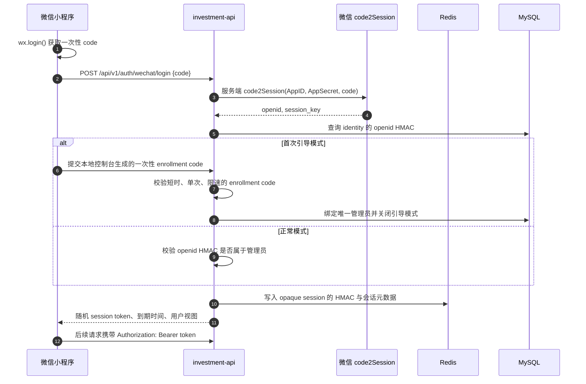
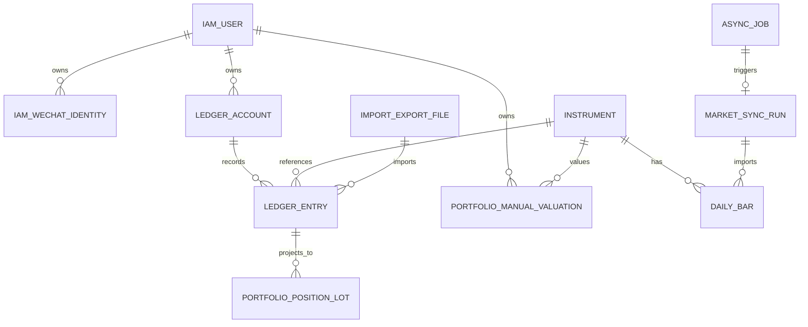
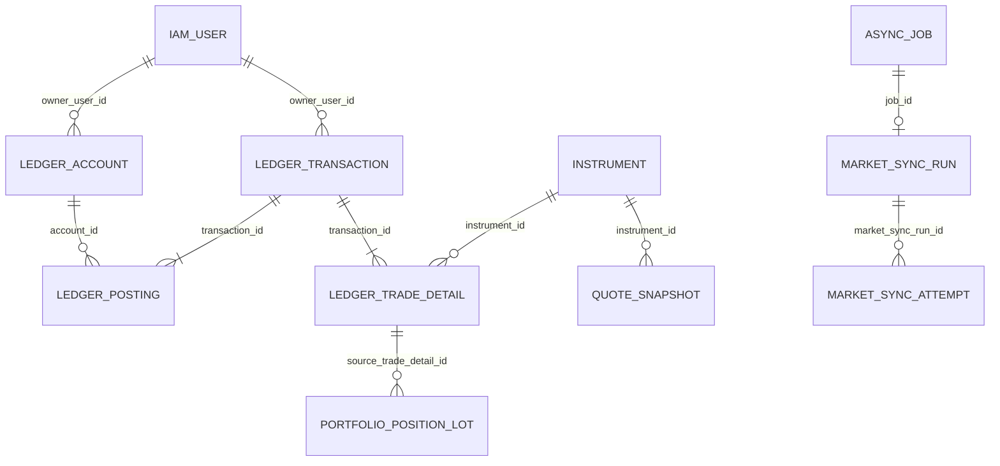
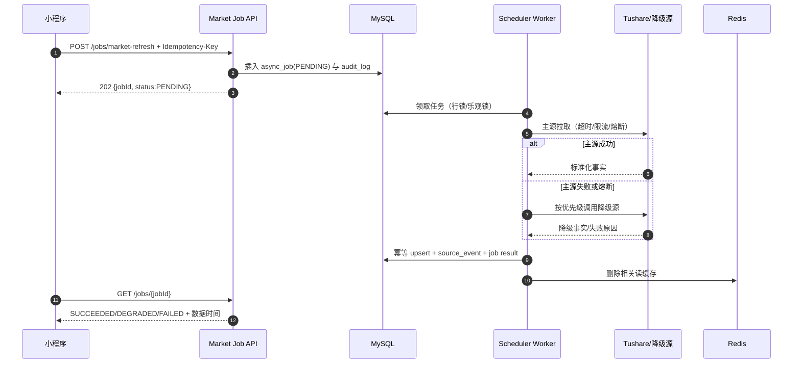

# 微信小程序 + Java DDD 后端实施规划

**状态：** v1.11 第十轮（金融账务 + 微信发布第二次独立审阅）完成；Phase 2 的唯一可执行账本规格为 [phase2-ledger-spec.md](phase2-ledger-spec.md)，最终语义 schema 已在 MySQL 8.4.10 实际迁移并通过结构门禁，Phase 1 身份与会话基础代码已实现并完成本地 API 回归。
**制定日期：** 2026-07-26
**目标仓库：** 本仓库
**部署参数：** 全部以占位符表示，先完成本地可运行版本

## 1. 已确认的范围与决策

### 1.1 产品边界

| 项目 | 已确认结论 |
| --- | --- |
| 用户范围 | 首期是个人私有账户；不开放公开注册、社交、协作或付费功能。 |
| 身份认证 | 小程序使用 `wx.login`；后端以 `openid` 识别用户，只有预配置管理员的 `openid` 可访问。 |
| 业务性质 | 仅提供个人投资记录、行情/估值展示、策略计算与提醒；不提供交易、支付、代客理财、跟单、券商 API 或付费投顾。 |
| 功能范围 | 完整迁移现有仪表盘的总览、账本流水、资产估值、高分红、QQQ、IC/IM、深度 Put、报表、行情刷新和多端同步。 |
| 短线能力 | 扫描和回测转为后端异步任务；小程序只提交任务、查看状态和结果，不能直接执行本地脚本。 |
| 数据时效 | 以 Tushare 的收盘后/延迟数据为主；既有中证指数、腾讯、新浪、Yahoo 等来源只作降级；不采购实时行情授权。 |
| 数据刷新 | 使用 XXL-JOB 调度中心在非交易时段执行市场刷新；初始任务窗口为 `Asia/Shanghai` 凌晨，最终 Cron 与数据源可用时间均为 `TBD`。 |
| 部署策略 | 先在本地通过容器完成 Java 后端验证；云厂商、地域、域名、备案、证书和托管服务均为待填占位符。 |
| 架构策略 | 首期采用 DDD 模块化单体；不实际运行 MQ、RPC、TCC 或 Elasticsearch，但预留可演进边界。 |
| 账本模型 | 采用**复式分录**：一个不可变的货币 `ledger_transaction` 产生两条或多条 `ledger_posting`；内部划转、保证金、费用、冲正均必须有可审计的对手分录。拆股、并股、送股是独立不可变非货币账本事件。 |
| 金额与币种 | 所有货币金额在数据库中使用原币种整数 `*_cent BIGINT`（人民币分、美元美分）；前端按 `currency` 转换为带两位小数的显示值。金额字段不得使用 `DECIMAL`、`FLOAT` 或“万元”。 |
| 外币边界 | 行情仅保存并展示美元原价；首期**不保存、不拉取、不推算汇率**。汇总接口按币种分组，禁止把 CNY 与 USD 相加成一个“总资产”。 |
| 对账边界 | 长期不接券商 API；只支持手工输入券商现金/持仓的对账事实和证据哈希。差异进入 `NEEDS_REVIEW`，绝不自动调账。 |
| 数据库拆分 | 业务表按 DDD 限界上下文拆到多个 MySQL 逻辑库（schema），但首期共用一个 MySQL 8.4 实例和一个 JDBC 事务边界；跨库关联仅保存目标实体的语义化业务 ID（如 `user_id`、`transaction_id`），不建立外键。 |

### 1.2 非目标

- 不把小程序做成证券交易终端，不连接券商下单或券商 API、不托管资金，也不接入微信支付。
- 不做实时行情、全市场数据仓库、量化交易执行或面向陌生用户的开放平台。
- 不把现有 Python 服务直接暴露到公网；迁移完成后，Java 是唯一的线上后端实现。
- 不为单个私人用户过早拆分微服务、引入分布式事务或维护 ES 集群。

### 1.3 成功标准

1. 微信开发者工具可以使用开发环境 AppID 登录，管理员微信号能进入小程序，其他 `openid` 被拒绝。
2. 本地 Docker Compose 启动后，账本、市场数据、报表和异步任务均由 Java API 服务提供，不再依赖浏览器 `localStorage` 或 Gitee 作为主数据源。
3. 从现有 JSON/SQLite 导入后，流水数量、持仓数量、余额、估值和历史曲线与导入前核对一致；旧账本的“万元”金额必须精确转换为 CNY 分，不一致即阻断迁移。
4. 六类现有业务视图均能在小程序完成查看和写入；“刷新行情”和“短线任务”均以异步任务方式可追踪。
5. 所有写接口需身份认证、参数校验、幂等键和审计记录；Tushare 令牌、微信 AppSecret、数据库密码都不进入前端或 Git。
6. 本地环境具备测试、备份、恢复、指标和日志验证路径；云部署只替换基础设施参数，不改变业务代码。
7. 正式发布前，所有已展示市场数据都有可追溯的授权/使用范围证据；未通过该门禁的数据源和字段自动从发布配置中移除。

### 1.4 实施前强制门禁与 TBD

| 门禁 | 在进入的阶段前必须完成 | 当前状态 |
| --- | --- | --- |
| 数据源许可矩阵 | 逐项确认 Tushare、指数、腾讯、新浪、Yahoo 的接口、缓存、展示、二次分发、归因和频率限制；形成可审计证据。 | `TBD`，阻断正式发布，不阻断本地 mock 开发。 |
| 微信与云发布参数 | `<WECHAT_APP_ID>`、`<WECHAT_APP_SECRET>`、`<PROD_DOMAIN>`、主体/备案要求、request/upload 合法域名、证书、隐私指引、30 天附件保留声明和真机回归。 | `TBD`，阻断体验版和正式发布。 |
| XXL-JOB 版本与许可 | `<XXL_JOB_VERSION>`、GPL-3.0 使用方式、镜像来源、管理员账号、持久化库和备份策略。 | `TBD`，阻断将 XXL-JOB 带入生产镜像。 |
| 数据恢复目标 | `<RPO>`、`<RTO>`、`<BACKUP_RETENTION_DAYS>`、`<LOG_RETENTION_DAYS>`、告警接收人。 | `TBD`，阻断正式发布。 |
| 实现启动门禁 | 执行 V1 基线及后续增量迁移，断言 38 张自研业务表、无任意 `biz` 命名字段/索引、无外键、所有金额为 `*_cent BIGINT`。本地已在 MySQL 8.4.10 完成 V1/V2；仓库内已补同断言的 Testcontainers 用例。当前机器没有 Docker socket，CI 或可用 Docker 环境必须执行该用例。Ledger→Portfolio 依赖规则与 FIFO 重放在对应业务代码出现后以架构/集成测试验证。 | schema 与 Phase 1 身份基础已通过；未完成的代码级断言阻断对应业务能力合入。 |
| 容量与安全基线 | `<IMPORT_MAX_BYTES>`、`<MAX_HISTORY_POINTS>`、`<MAX_JOB_CONCURRENCY>`、`<MAX_API_REQUEST_BYTES>`、依赖/许可证/SBOM 扫描阈值、网络与账号矩阵。 | `TBD`；不阻断本地骨架和 mock 开发，阻断导入/任务正式启用、体验版与正式发布。 |

## 2. 当前实现调研与迁移边界

### 2.1 可复用的业务事实

- 当前业务已经按 `ledger -> market_data <- short_term` 划分，分别对应账本、市场数据和短线策略，见 `modules/README.md:3-9`。新的限界上下文沿用该业务方向，不能按 Controller/Service/DAO 重新混杂。
- 当前手机入口是静态 HTML，顶部已有重算、同步、导入导出等操作，见 `apps/dashboard/index.html:10-26`；现有六个底部导航为总览、高分红、QQQ、IC/IM、深度 Put、报表，见 `apps/dashboard/index.html:28-53`。
- 现有本地 API 已覆盖估值、报价、历史、观察池、异步刷新、账本与同步，见 `apps/dashboard/data/README.md:23-37`。这是新 REST API 的能力基线，不是可以原样复制的协议。
- 当前账本以浏览器 `localStorage` 为主、SQLite 快照为镜像，SQLite 的 `snapshots(payload_json)` 仅保存整体 JSON，见 `apps/dashboard/data/README.md:72-90` 和 `modules/ledger/local_service.py:429-475`。新后端必须改为规范化关系模型，快照只作为备份/审计能力保留。
- 现有市场事实库已经定义了标的、行情、估值、复权和贴水五类事实，见 `docs/designs/market-data-sqlite-schema.md:31-69`；`daily_bars`、`daily_metrics`、`derived_indicators`、`basis_snapshots`、`source_events` 的迁移语义可直接复用，见同文件 `:187-265`、`:307-418`。
- 现有数据源优先级是 `Tushare > legacy_json > Sina > Tencent > Yahoo`，并会记录降级原因，见 `docs/designs/market-data-sqlite-schema.md:586-599`。该优先级是后端数据源适配器的初始策略。
- 当前的市场刷新已经是“提交任务、轮询状态、任务内抓取”的模式，见 `docs/designs/market-data-sqlite-schema.md:563-584`。新系统要保留异步交互语义，但不能保留内存任务状态。

### 2.2 需要纠正的产品形态

微信原生 `tabBar` 最多只有 5 个入口，因此不能把当前 6 个底部导航机械照搬。目标信息架构为：

| 小程序一级 tab（5 个） | 二级页面/功能 | 对应当前能力 |
| --- | --- | --- |
| 总览 | 风险仪表、现金池、目标差额、今日摘要 | 总览 |
| 账本 | 流水、持仓、资产估值、导入/导出 | 账本流水、估值、同步 |
| 策略 | 高分红、QQQ、IC/IM、深度 Put 的分段页 | 四个策略模块 |
| 市场 | 观察池、行情、估值、刷新任务、数据质量 | 行情刷新、IC/IM 估值、观察池 |
| 报表 | 净值、资产分布、历史表现、任务结果 | 报表、短线结果 |

“策略”页使用四个顶部标签或卡片入口，不能用自定义底部导航绕开原生 tabBar 限制。短线策略在“报表”内展示结果，在“市场”内发起刷新/扫描任务。

## 3. 总体架构

### 3.1 首期部署拓扑

```mermaid
flowchart LR
    MP["微信小程序\nTypeScript / WXML / WXSS"]
    WX["微信登录服务\ncode2Session"]
    API["investment-api\nJava 21 + Spring Boot\nDDD 模块化单体"]
    DB[("MySQL 8.4 单实例\nidentity/ledger/portfolio/market/... 逻辑库"])
    R[("Redis\n会话、缓存、限流"])
    OBJ[("MinIO\n导入导出与备份对象"])
    XXLA["XXL-JOB Admin\n调度中心"]
    XXLE["investment-api Executor\nXXL-JOB Handler"]
    JOB["async_job\n用户触发的持久化任务"]
    DATA["Tushare / 指数 / 公开降级源"]
    OBS["Prometheus + Grafana\nLoki / 云日志"]

    MP -->|"HTTPS REST /api/v1"| API
    MP -->|"wx.login code"| WX
    API -->|"服务端 code2Session"| WX
    API --> DB
    API --> R
    API --> OBJ
    API --> JOB
    XXLA --> XXLE
    XXLE --> DATA
    XXLE --> DB
    API --> OBS
    XXLA --> OBS
    XXLE --> OBS

    MQ["未来：RocketMQ"]
    RPC["未来：gRPC + Protobuf"]
    API -. "达到拆分阈值后" .-> MQ
    API -. "跨服务后" .-> RPC
```

### 3.2 为什么是模块化单体

首期只有一个受信任用户，所有核心写操作都可落在同一个 MySQL 事务中。以微服务替代模块化单体会带来网络调用、版本治理、分布式追踪、重复部署、事务补偿和故障排查成本，却没有业务收益。

因此：

- **小程序到后端：** HTTPS REST + JSON，接口由 OpenAPI 3.1 描述；不让小程序调用 RPC。
- **模块之间：** Java 接口/领域事件，在同一进程内调用；模块只依赖对方的 application port 或只读查询接口。
- **数据一致性：** 首期逻辑库均在同一个 MySQL 实例内；同一用户命令可在一个本地 ACID 事务中写入 `ledger_db`、`platform_db` 和必要投影。未来物理拆库后才改为 Outbox + Saga，不能把当前 schema 拆分误当成分布式事务。
- **拆分阈值：** 只有在出现独立扩缩容、独立发布团队、单个异步任务明显拖累 API、或跨模块调用成为稳定远程边界时，才拆服务。拆分后优先使用 gRPC + Protobuf；异步事件使用 RocketMQ。

### 3.3 DDD 限界上下文与依赖方向

| 限界上下文 | 聚合/职责 | 可依赖内容 | 禁止依赖 |
| --- | --- | --- | --- |
| Identity | 管理员身份、一次性引导、会话、授权、审计主体 | 微信登录 adapter、Redis、MySQL repository port | 账本和策略领域实现 |
| Ledger | **唯一账务事实源**：现金流、追加、卖出、分红、期货保证金、冲正流水、快照与导入导出；只发布不可变账务事实 | 不依赖任何其他业务上下文；只使用自身 repository port 与 Platform 通用事务/幂等 port | Portfolio、Market Data、Strategy、Reporting 的任何 port、HTTP、MyBatis、Redis 类 |
| Portfolio | 从 Ledger 投影出的持仓/成本/资产桶/风险汇总；独立的手工估值覆盖 | Market Data 查询 port、Ledger 只读流水 port | 直接修改账本事实、小程序 DTO、外部数据源 SDK |
| Market Data | 标的、报价、日线、指标、贴水、数据质量 | 数据源 adapter、任务 port | 账本写模型 |
| Strategy | 高分红、QQQ、IC/IM、Put 规则；短线信号和回测结果 | Market Data、Portfolio 的只读 port | 直接修改账本流水 |
| Reporting | 净值、分布、趋势和可下载报表的读模型 | 各上下文发布的只读查询/事件 | 写入业务聚合 |
| Platform | 异步任务、幂等、Outbox、配置、对象存储、可观测性 | 基础设施 adapter | 具体业务规则 |

每个上下文的包结构固定如下，领域层不得 import Spring、MyBatis、Redis、HTTP、微信 SDK 或 Tushare SDK：

```text
services/investment-api/src/main/java/com/personal/investment/
  bootstrap/                         # 启动、依赖装配、配置
  identity/{interfaces,application,domain,infrastructure}/
  ledger/{interfaces,application,domain,infrastructure}/
  portfolio/{interfaces,application,domain,infrastructure}/
  marketdata/{interfaces,application,domain,infrastructure}/
  strategy/{interfaces,application,domain,infrastructure}/
  reporting/{interfaces,application,domain,infrastructure}/
  platform/{application,domain,infrastructure}/
```

`interfaces` 只承接 REST DTO、鉴权和响应映射；`application` 只编排用例和事务；`domain` 放聚合、值对象、领域服务和 repository port；`infrastructure` 实现 MySQL、Redis、对象存储、外部数据源和消息 port。

### 3.4 账务唯一事实源与聚合不变量

1. `LedgerTransaction` 是业务动作聚合根，`ledger_posting` 是其不可变复式分录。每一笔交易至少有两条金额分录，且同一 `currency` 下借贷净额必须为零；外部入金/出金使用同币种的系统对手账户，不能以单边“余额加减”代替分录。
2. `ledger_transaction`、`ledger_posting`、`ledger_trade_detail` 不可原地修改金额、动作、业务日期或标的。用户“编辑/撤销”在同一事务中写入一笔反向冲正交易；如需新值，再追加替代交易。原始交易、冲正交易和替代交易以 `correction_root_transaction_id` 与 `revision_no` 形成受控链，不删除历史。
3. 所有货币字段以 `*_cent BIGINT` 保存，正负影响由 `posting_side` 决定而不是由金额符号猜测；期货指数点位、数量、比例和复权因子不是货币，可分别使用 `DECIMAL`。美元原价也是 USD 美分，不进行 FX 换算。
4. `PortfolioPosition`、`portfolio_position_lot`、`portfolio_daily_snapshot` 都是可重放投影，**不是第二个可写账本**。它们只单向消费 Ledger 事实、原币种市场行情和手工估值覆盖计算；Ledger 绝不回调 Portfolio。重放不一致时替换投影并告警。
5. 股票、ETF 与期权现货成本的首期唯一方法是 **FIFO**：按 `(occurred_on, transaction_id, detail_no)` 排序消费未平批次；部分卖出逐批扣减 `remaining_quantity`，已实现损益为同币种卖出净收入减去 FIFO 分配成本和费用。禁止混用移动加权平均；卖出数量超过可用现货批次、跨币种成本或无法分配批次时，交易拒绝入账并进入 `NEEDS_REVIEW`。期货以合约和结算事实计算，不复用现货 FIFO。
6. `PortfolioManualValuation` 是独立聚合，必须带有效时间、来源、优先级、币种和操作者；它不能反向改写流水或成本。跨币种持仓仅按币种展示，禁止生成混币净值、收益率或风险阈值。
7. `StrategyEvaluation` 与 `ReportSnapshot` 为不可变结果，保存规则版本、输入事实版本、计算时间和数据截止时间；策略不允许直接生成账本流水。
8. 每个跨上下文命令先在 application 层确定唯一 owner 和版本，再在单一 MySQL 实例事务内写入事实、持久化幂等记录与审计；重建投影或发送通知属于事务后的后置工作。

## 4. 前端小程序方案

### 4.1 技术选型

| 层次 | 选型 | 原因 |
| --- | --- | --- |
| 运行时 | 微信原生小程序 | 首发只面向微信，原生能力、审核链路和性能最直接；不引入跨端框架的兼容层。 |
| 语言 | TypeScript | 对账本金额、交易动作、策略状态、API DTO 进行编译期约束。 |
| 视图 | WXML + WXSS + JSON 配置 | 遵循小程序原生页面生命周期、分包和审核机制。 |
| 组件 | TDesign MiniProgram | 统一表单、弹窗、空状态、列表、导航和主题，不自行维护基础组件库。 |
| 状态管理 | `mobx-miniprogram`，按 feature 划分 store | 全局只保存会话、用户、轻量偏好；页面业务状态不放在单一巨型 store。 |
| 图表 | ECharts 小程序适配层 | 复用折线、堆叠面积、环形、柱状图；图表输入由后端 ViewModel 提供。 |
| 网络 | 统一 `httpClient` 封装 | 自动携带会话令牌、请求 ID、超时、错误码映射、幂等键和登录重试。 |
| 本地存储 | `wx.setStorage` | 只缓存 token、最近读模型和 UI 偏好；账本真相只在后端。 |

### 4.2 页面与交互设计

| 页面 | 首屏内容 | 核心操作 | 设计要求 |
| --- | --- | --- | --- |
| 总览 | 总资产、净值、现金安全垫、风险状态、今日数据时间 | 下拉刷新、查看风险解释 | 一屏先回答“现在的资产与风险”，策略建议必须带数据时间与“非投资建议”说明。 |
| 账本 | 资产桶与持仓摘要、最近交易 | 新增/冲正交易、手工估值、手工对账、导入/导出 | API 金额模型为 `MoneyDto { cent: string, currency }`；前端以十进制字符串精确格式化，不转换为浮点数。提交前展示复式分录影响预览，不提供物理删除或自动调账。 |
| 策略 | 高分红、QQQ、IC/IM、Put 四张状态卡 | 查看规则、录入相关流水、查看前提条件 | 把规则计算和历史数据时间显式展示；不可呈现为交易指令。 |
| 市场 | 观察池、报价、PB/PE、IC/IM 贴水、任务状态 | 请求刷新、查看来源/降级原因 | 刷新立即返回任务编号并轮询；数据过期、降级、缺失要可视化。 |
| 报表 | 净值曲线、资产/策略分布、收益和外部现金流说明 | 时间范围、导出、查看短线任务结果 | 首屏优先轻量摘要；历史曲线和导出放分包。 |

视觉规范：采用“深墨绿/暖白/琥珀风险色”的低刺激金融记录风格；数字优先、卡片克制、单手可操作。状态颜色固定为正常/关注/风险，但绝不只依赖颜色表达。所有来源、更新时间、手工覆盖和数据质量提示使用可读文本。

每个写入页都必须定义并实现：`loading`、`empty`、`read-only-offline`、`submitting`、`succeeded`、`retryable-error`、`version-conflict`、`data-stale` 八种状态。离线时只允许读取已缓存的带 `asOf` 标记的数据；不得把流水悄悄写入本地待同步队列。

### 4.3 前端目录与分包

```text
apps/miniprogram/
  app.ts app.json app.wxss
  pages/overview/
  pages/ledger/
  pages/strategy/
  pages/market/
  pages/reports/
  packages/ledger-editor/             # 录入、导入导出
  packages/charts/                    # 重型图表页
  packages/strategy-detail/           # 四类策略详情与解释
  components/
  features/{auth,ledger,portfolio,market,strategy,reporting}/
  services/{http,auth,storage}/
  config/{local,release}/              # 仅构建期注入；不得运行时切换至 local
  shared/{types,formatters,constants}/
```

分包原则：总览、登录和基本账本留主包；图表、导入导出、策略详情和短线结果放普通分包。页面不得直接 `wx.request`，不得把 AppSecret、Tushare Token、数据库密码或管理员名单写入前端。local 构建可使用 `http://127.0.0.1` 与 Mock；体验版/正式版构建必须固定 HTTPS API/上传域名、启用 URL 校验、移除 local 登录入口、排除 `node_modules` 源目录和测试密钥。

### 4.4 微信登录时序



`code` 只能使用一次；`session_key` 不返回小程序，且本项目不需要解密微信用户数据时不持久化它。首次绑定时，服务器处于 `BOOTSTRAP_PENDING`：本地控制台生成高熵、短时、单次且限速的一次性 enrollment code，管理员在自己的小程序内显式输入后才完成 `openid` 绑定，随后永久关闭该模式。正常会话使用 256-bit 不透明随机 token；Redis 仅保存 token HMAC、用户 ID、权限版本、30 分钟滑动过期和 8 小时绝对过期。登出、拒绝访问、权限变更和密钥轮换均立即失效该用户全部会话。

## 5. Java 后端与本地运行方案

### 5.1 技术基线

| 类别 | 首期选型 | 说明 |
| --- | --- | --- |
| JDK/框架 | Java 21 LTS + Spring Boot 3.5.14 | 与当前 Phase 1 已实现、已回归的基线一致；后续升级 Spring Boot 前必须单独完成依赖、Flyway 与安全回归。 |
| 构建 | Maven Wrapper | 版本锁定、CI 和本地一致。 |
| Web/API | Spring MVC、Spring Validation、Spring Security、springdoc-openapi | 采用同步 REST；OpenAPI 作为前后端契约。 |
| 数据访问 | MyBatis + HikariCP + Flyway | SQL 明确归属基础设施层，Flyway 负责不可变迁移，避免 ORM 反向污染领域模型。 |
| 数据库 | MySQL 8.4 LTS | 事务、JSON、索引、备份和云托管成熟；本地使用官方容器。 |
| 缓存 | Redis 7.x + Spring Data Redis | 仅缓存/会话/限流/锁，不保存唯一业务真相。 |
| 对象存储 | MinIO（本地） | 保存导入原件、导出文件和备份；上云时替换为 `<CLOUD_OBJECT_STORAGE>`。 |
| 计划任务 | XXL-JOB Admin + `investment-api` Executor | 调度中心与业务执行器分离；首期只调度市场/报表批处理，不把业务逻辑写进 GLUE。版本和 GPL-3.0 使用评审为 `TBD`。 |
| 异步命令 | `async_job` + 应用内 Worker | 用户点击“刷新/导入/导出/扫描”后立即返回任务号；任务可恢复、可重试、可审计。 |
| 韧性 | Resilience4j + Bucket4j | 外部数据源的超时、重试、熔断、隔离、限流和 last-known-good 降级。 |
| 日志/指标 | JSON stdout + Micrometer/Prometheus + Grafana；Loki/云日志 | 首期不部署 Elasticsearch。 |
| 测试 | JUnit 5、AssertJ、ArchUnit、Testcontainers、WireMock | 覆盖领域、架构边界、MySQL/Redis 集成与外部数据源降级。 |

### 5.2 本地 Compose

```text
infra/docker-compose.local.yml
  mysql       -> 3306（仅本机暴露）
  redis       -> 6379（仅本机暴露）
  minio       -> 9000/9001（仅本机暴露）
  xxl-job-admin -> 8081（仅本机暴露，独立 xxl_job schema）
  prometheus  -> 9090（可选，开发期启用）
  grafana     -> 3000（可选，开发期启用）
  loki        -> 3100（可选，开发期启用）

services/investment-api
  ./mvnw spring-boot:run --spring.profiles.active=local

apps/miniprogram
  微信开发者工具导入并指向 http://127.0.0.1:<API_PORT>
```

`.env.example` 只包含变量名，例如 `WECHAT_APP_ID`、`WECHAT_APP_SECRET`、`BOOTSTRAP_ENROLLMENT_SECRET`、`TUSHARE_TOKEN`、`MYSQL_PASSWORD`、`REDIS_PASSWORD`、`OBJECT_STORAGE_*`、`XXL_JOB_ADMIN_ADDRESS`、`XXL_JOB_ACCESS_TOKEN`。真实 `.env` 被 Git 忽略。开发者工具环境允许本地请求只用于开发；真机预览、体验版和正式版必须使用 HTTPS 及已配置的合法域名。

## 6. 数据库设计

### 6.1 设计总则

- 所有**自研业务表**固定使用 `id BIGINT UNSIGNED AUTO_INCREMENT` 物理主键和与实体同名的 `*_id CHAR(26) CHARACTER SET ascii COLLATE ascii_bin`（大写 ULID）业务主键；两者均为 `NOT NULL`，业务 ID 全局唯一。完整命名以 [business-id-naming-v2.md](business-id-naming-v2.md) 为唯一真源。Flyway、XXL-JOB 等第三方框架元表不承载业务关系或对外 ID，不适用本规则。
- 任何跨表关系只保存目标实体的语义化业务 ID，例如 `owner_user_id`、`transaction_id`、`instrument_id`；业务接口、消息与对象路径都不得传递或依赖物理 `id`。禁止 `biz_id`、`*_biz_id`、`parent_id`、`related_id`、`resource_id`、`aggregate_id` 等泛化关系名。多态审计、幂等响应和未来 Outbox 只保存不可参与领域查询的 `*_reference` 文本，不构成关系键。
- **所有货币金额均为原币种的整数分。** 列名必须以 `_cent` 结尾、类型为 `BIGINT`，例如 `amount_cent`、`unit_price_cent`、`fee_cent`、`margin_cent`、`market_value_cent`、`turnover_cent`；金额绝对值由 `CHECK (> 0)` 或应用校验保证，方向以 `posting_side` 表示。数据库和 Java 均禁止以 `FLOAT/DOUBLE` 处理货币。
- CNY 与 USD 都按两位小数的最小单位存储（分/美分），且每个金额必须紧邻 `currency CHAR(3)` 或由同一行不可变的 `currency` 唯一确定。小程序负责格式化，例如 `12345 + CNY -> ¥123.45`、`12345 + USD -> US$123.45`；不得在前端把“万元”或浮点金额传给 API。
- SQL `BIGINT` 在 Java 领域层使用 `long`；为避免 JSON/JavaScript 安全整数边界，REST 与小程序 DTO 中所有 `*_cent` 均使用十进制**字符串**传输，例如 `"12345"`，前端格式化器以字符串插入小数点，不使用 `Number`、`parseFloat` 或“万元”换算。
- 股票、ETF、期权等货币价格使用 `*_price_cent`；数量、比例、复权因子、期货指数点位与贴水并非货币，可使用 `DECIMAL(24,8)`。期货合约乘数按每点原币种最小单位存储为 `contract_multiplier_cent BIGINT`；期权合约乘数是非货币标的单位数，使用正整数 `contract_multiplier BIGINT`，不得以 `_cent` 命名。
- 首期不维护汇率：市场行情保存 `native_currency` 与原币种 `price_cent`；汇总、报表、净值和策略输入均按币种分桶。禁止 CNY/USD 混加；需要跨币种风险计算的页面显示 `FX_NOT_ENABLED`，而不是伪造人民币估值。
- 所有时间采用 `DATETIME(3)` UTC 存储，展示时转 `Asia/Shanghai`；交易日使用 `DATE` 并以市场交易日历解释。
- 私有业务表以 `owner_user_id` 归属；行情事实是共享数据，不带 owner。账务、行情、审计和任务历史不物理删除；未来若引入可恢复删除，必须显式增加 `deleted_at` 和恢复审计。可变聚合按需要带 `created_at`、`created_by_user_id`、`updated_at`、`updated_by_user_id` 与 `version` 乐观锁。
- 所有表遵循 MySQL 三大范式：第一范式保证字段原子化；第二范式保证非主键字段依赖完整候选键；第三范式禁止把标的名称、用户昵称、账户名称等可变属性复制进事实表。可重建读模型可做受控反范式，但必须带 `projection_version` 和来源版本。
- **不使用数据库外键。** 语义化 `*_id` 是受索引保护的业务映射键，不复制目标表可变属性。应用层在同一事务内校验目标存在、状态可用、owner 一致；每日 `reference-integrity-scan` 扫描悬挂映射并转为 `NEEDS_REVIEW`，绝不自动篡改账务事实。
- Flyway 每次变更只新增版本化 SQL；禁止手工改线上表或修改已执行迁移。CI 必须通过 schema lint：每张自研业务表同时有 `id`、[业务 ID 命名规范](business-id-naming-v2.md) 指定的唯一实体 ID、关系字段与目标实体 ID 同名、不存在 `FOREIGN KEY`/`REFERENCES`，且所有 `_cent` 列为 `BIGINT`。

<!--
以下为 v1.1--v1.3 的历史草案，仅为 Git 审计追溯，已被完整注释，不能作为实施、复制、评审基线或 Flyway 输入。
其中出现的 biz_id、单边 ledger_entry 与 DECIMAL 金额模型均已废弃；当前实施只能以本节设计总则、mysql-ddd-schema-v1.sql 与 phase2-ledger-spec.md 为准。

### 6.2 v1.1 表分组（已废弃，仅保留审查追溯；不得据此实现）

> 以下第 6.2 至 6.6 节为 v1.1 的历史草案，包含单边 `ledger_entry` 与 `DECIMAL` 金额列，**全部禁止实现**。唯一有效的数据模型从第 6.7 节开始。

| 分组 | 核心表 | 关键字段/约束 |
| --- | --- | --- |
| 身份与安全 | `iam_user`、`iam_wechat_identity`、`iam_login_audit` | 每张表均有 `biz_id`；`openid_hmac + hmac_key_version` 可轮换，密文可轮换；`iam_user.status` 仅允许 `ACTIVE/DENIED`；不持久化明文 AppSecret 或 `session_key`。 |
| 账本 | `ledger_account`、`ledger_entry`、`ledger_snapshot` | `ledger_entry` 是唯一账务事实，有业务日期、动作、标的、金额、币种、备注、来源、冲正关联；`client_request_id` 与 `owner_user_biz_id` 唯一。 |
| 持仓与估值 | `portfolio_position`、`portfolio_position_lot`、`portfolio_manual_valuation`、`portfolio_daily_snapshot` | 均为可重建投影或独立手工估值覆盖；非期货按持仓批次计算成本，期货保存合约、手数、乘数、保证金和名义敞口。 |
| 市场主数据 | `instrument`、`instrument_alias`、`watchlist`、`watchlist_item` | `(market, symbol)` 唯一；保留 Tushare 代码、资产类型、数据源和 wiki 来源。 |
| 市场事实 | `market_sync_run`、`quote_snapshot`、`daily_bar`、`daily_metric`、`adjustment_factor`、`derived_indicator`、`basis_snapshot`、`market_source_event` | 复用现有 SQLite 事实模型；事实表只依赖 `instrument`、来源、业务日期和同步批次，唯一键包含标的、日期、来源和口径。 |
| 策略与报告 | `strategy_rule_version`、`strategy_evaluation`、`signal_run`、`strategy_signal`、`backtest_run`、`backtest_result`、`report_snapshot` | 规则版本、输入数据版本、结果时间必须可追溯；结果不覆盖历史。 |
| 平台能力 | `async_job`、`outbox_event`、`idempotency_record`、`audit_log`、`feature_flag`、`import_export_file` | 每张表使用 `biz_id` 和 `*_biz_id` 映射；任务持久化、Outbox、操作审计和导入原件统一治理。 |

### 6.3 v1.1 索引与约束（已废弃）

| 表 | 约束/索引 | 用途 |
| --- | --- | --- |
| `ledger_entry` | `UNIQUE(owner_user_biz_id, client_request_id)`；`UNIQUE(owner_user_biz_id, correction_of_entry_biz_id)`；`INDEX(owner_user_biz_id, occurred_on DESC)` | 防重复提交、阻止同一流水重复冲正、支持账本列表查询。 |
| `portfolio_position` | `UNIQUE(owner_user_biz_id, instrument_biz_id, account_biz_id)` | 用户同账户同标的只有一个汇总持仓。 |
| `daily_bar` | `UNIQUE(instrument_biz_id, trade_date, adjustment, source)`；`INDEX(instrument_biz_id, trade_date DESC)` | 幂等行情同步和曲线读取。 |
| `daily_metric` | `UNIQUE(instrument_biz_id, trade_date, metric_name, source)` | PB/PE 等指标可追溯。 |
| `basis_snapshot` | `UNIQUE(underlying_instrument_biz_id, future_instrument_biz_id, trade_date, source)` | IC/IM 贴水结果可重放。 |
| `async_job` | `INDEX(status, next_run_at)`；`INDEX(job_type, created_at DESC)` | 可靠轮询、重试与结果查询。 |
| `market_sync_attempt` | `UNIQUE(market_sync_run_biz_id, attempt_no)`；`INDEX(status, started_at)` | 保留每次重试、人工重跑和失败原因。 |
| `outbox_event` | `INDEX(status, occurred_at)`；`UNIQUE(aggregate_type, aggregate_id, event_type, event_version)` | 事件投递幂等。 |
| `audit_log` | `INDEX(actor_user_biz_id, occurred_at DESC)`；`INDEX(resource_type, resource_biz_id)` | 安全追溯。 |

### 6.4 v1.1 核心关系与关键 DDL（已废弃）



以下 DDL 是实现前必须落入 Flyway 的字段基线；迁移必须先创建 `ledger_account`、`instrument`，再创建引用它们的 `ledger_entry`。索引、字段长度、枚举值、外键删除策略如与数据源/小程序事实冲突，先修改本文件并标为 `TBD`，不得在业务代码里临时发明字段。

```sql
CREATE TABLE iam_user (
  id BIGINT UNSIGNED NOT NULL AUTO_INCREMENT PRIMARY KEY,
  biz_id CHAR(26) NOT NULL UNIQUE,
  status VARCHAR(16) NOT NULL,
  created_at DATETIME(3) NOT NULL,
  updated_at DATETIME(3) NOT NULL,
  version BIGINT UNSIGNED NOT NULL DEFAULT 0,
  CHECK (status IN ('ACTIVE', 'DENIED'))
);

CREATE TABLE iam_wechat_identity (
  id BIGINT UNSIGNED NOT NULL AUTO_INCREMENT PRIMARY KEY,
  biz_id CHAR(26) NOT NULL UNIQUE,
  user_biz_id CHAR(26) NOT NULL,
  openid_hmac BINARY(32) NOT NULL UNIQUE,
  hmac_key_version SMALLINT UNSIGNED NOT NULL,
  openid_ciphertext VARBINARY(512) NULL,
  encryption_key_version SMALLINT UNSIGNED NULL,
  created_at DATETIME(3) NOT NULL,
  KEY idx_wechat_identity_user_biz (user_biz_id)
);

CREATE TABLE ledger_account (
  id BIGINT UNSIGNED NOT NULL AUTO_INCREMENT PRIMARY KEY,
  biz_id CHAR(26) NOT NULL UNIQUE,
  owner_user_biz_id CHAR(26) NOT NULL,
  account_type VARCHAR(32) NOT NULL,
  name VARCHAR(128) NOT NULL,
  currency CHAR(3) NOT NULL,
  status VARCHAR(16) NOT NULL,
  created_at DATETIME(3) NOT NULL,
  updated_at DATETIME(3) NOT NULL,
  version BIGINT UNSIGNED NOT NULL DEFAULT 0,
  UNIQUE KEY uk_ledger_account_name (owner_user_biz_id, name),
  KEY idx_ledger_account_owner_biz (owner_user_biz_id)
);

CREATE TABLE instrument (
  id BIGINT UNSIGNED NOT NULL AUTO_INCREMENT PRIMARY KEY,
  biz_id CHAR(26) NOT NULL UNIQUE,
  market VARCHAR(32) NOT NULL,
  symbol VARCHAR(64) NOT NULL,
  asset_type VARCHAR(32) NOT NULL,
  display_name VARCHAR(256) NOT NULL,
  currency CHAR(3) NOT NULL,
  contract_multiplier DECIMAL(24,8) NULL,
  created_at DATETIME(3) NOT NULL,
  updated_at DATETIME(3) NOT NULL,
  UNIQUE KEY uk_instrument_market_symbol (market, symbol)
);

CREATE TABLE ledger_entry (
  id BIGINT UNSIGNED NOT NULL AUTO_INCREMENT PRIMARY KEY,
  biz_id CHAR(26) NOT NULL UNIQUE,
  owner_user_biz_id CHAR(26) NOT NULL,
  account_biz_id CHAR(26) NOT NULL,
  instrument_biz_id CHAR(26) NULL,
  correction_of_entry_biz_id CHAR(26) NULL,
  client_request_id CHAR(36) NOT NULL,
  occurred_on DATE NOT NULL,
  action VARCHAR(32) NOT NULL,
  cash_direction VARCHAR(16) NOT NULL,
  amount DECIMAL(20,2) NOT NULL,
  quantity DECIMAL(24,8) NULL,
  unit_price DECIMAL(24,8) NULL,
  currency CHAR(3) NOT NULL,
  note VARCHAR(1000) NULL,
  created_at DATETIME(3) NOT NULL,
  created_by_user_biz_id CHAR(26) NOT NULL,
  UNIQUE KEY uk_ledger_entry_idem (owner_user_biz_id, client_request_id),
  UNIQUE KEY uk_ledger_entry_correction (owner_user_biz_id, correction_of_entry_biz_id),
  KEY idx_ledger_entry_owner_date (owner_user_biz_id, occurred_on DESC),
  KEY idx_ledger_entry_account_biz (account_biz_id),
  KEY idx_ledger_entry_instrument_biz (instrument_biz_id),
  CHECK (amount > 0),
  CHECK (cash_direction IN ('INFLOW', 'OUTFLOW', 'NEUTRAL')),
  CHECK (correction_of_entry_biz_id IS NULL OR correction_of_entry_biz_id <> biz_id)
);

CREATE TABLE portfolio_position (
  id BIGINT UNSIGNED NOT NULL AUTO_INCREMENT PRIMARY KEY,
  biz_id CHAR(26) NOT NULL UNIQUE,
  owner_user_biz_id CHAR(26) NOT NULL,
  account_biz_id CHAR(26) NOT NULL,
  instrument_biz_id CHAR(26) NOT NULL,
  quantity DECIMAL(24,8) NOT NULL,
  average_cost DECIMAL(24,8) NULL,
  source_ledger_version BIGINT UNSIGNED NOT NULL,
  projection_version BIGINT UNSIGNED NOT NULL,
  calculated_at DATETIME(3) NOT NULL,
  UNIQUE KEY uk_position_projection (owner_user_biz_id, account_biz_id, instrument_biz_id),
  KEY idx_position_owner_biz (owner_user_biz_id)
);

CREATE TABLE portfolio_position_lot (
  id BIGINT UNSIGNED NOT NULL AUTO_INCREMENT PRIMARY KEY,
  biz_id CHAR(26) NOT NULL UNIQUE,
  position_biz_id CHAR(26) NOT NULL,
  source_entry_biz_id CHAR(26) NOT NULL,
  opened_on DATE NOT NULL,
  opened_quantity DECIMAL(24,8) NOT NULL,
  remaining_quantity DECIMAL(24,8) NOT NULL,
  unit_cost DECIMAL(24,8) NOT NULL,
  source_ledger_version BIGINT UNSIGNED NOT NULL,
  calculated_at DATETIME(3) NOT NULL,
  UNIQUE KEY uk_position_lot_source (position_biz_id, source_entry_biz_id),
  KEY idx_position_lot_entry_biz (source_entry_biz_id),
  CHECK (opened_quantity > 0),
  CHECK (remaining_quantity >= 0 AND remaining_quantity <= opened_quantity)
);

CREATE TABLE portfolio_manual_valuation (
  id BIGINT UNSIGNED NOT NULL AUTO_INCREMENT PRIMARY KEY,
  biz_id CHAR(26) NOT NULL UNIQUE,
  owner_user_biz_id CHAR(26) NOT NULL,
  instrument_biz_id CHAR(26) NOT NULL,
  valuation_date DATE NOT NULL,
  market_value DECIMAL(20,2) NULL,
  unit_price DECIMAL(24,8) NULL,
  currency CHAR(3) NOT NULL,
  priority SMALLINT UNSIGNED NOT NULL,
  valid_until DATETIME(3) NULL,
  note VARCHAR(1000) NULL,
  created_at DATETIME(3) NOT NULL,
  created_by_user_biz_id CHAR(26) NOT NULL,
  KEY idx_manual_valuation_lookup (owner_user_biz_id, instrument_biz_id, valuation_date DESC),
  CHECK (market_value IS NOT NULL OR unit_price IS NOT NULL)
);

CREATE TABLE market_sync_run (
  id BIGINT UNSIGNED NOT NULL AUTO_INCREMENT PRIMARY KEY,
  biz_id CHAR(26) NOT NULL UNIQUE,
  async_job_biz_id CHAR(26) NULL,
  run_type VARCHAR(64) NOT NULL,
  trading_date DATE NOT NULL,
  source_policy_version VARCHAR(64) NOT NULL,
  status VARCHAR(24) NOT NULL,
  started_at DATETIME(3) NOT NULL,
  completed_at DATETIME(3) NULL,
  triggered_by VARCHAR(32) NOT NULL,
  created_at DATETIME(3) NOT NULL,
  KEY idx_market_sync_run_job_biz (async_job_biz_id),
  UNIQUE KEY uk_market_sync_run (run_type, trading_date, source_policy_version)
);

CREATE TABLE market_sync_attempt (
  id BIGINT UNSIGNED NOT NULL AUTO_INCREMENT PRIMARY KEY,
  biz_id CHAR(26) NOT NULL UNIQUE,
  market_sync_run_biz_id CHAR(26) NOT NULL,
  attempt_no SMALLINT UNSIGNED NOT NULL,
  trigger_type VARCHAR(32) NOT NULL,
  status VARCHAR(24) NOT NULL,
  source_name VARCHAR(64) NULL,
  started_at DATETIME(3) NOT NULL,
  completed_at DATETIME(3) NULL,
  error_code VARCHAR(64) NULL,
  error_summary VARCHAR(512) NULL,
  UNIQUE KEY uk_market_sync_attempt (market_sync_run_biz_id, attempt_no),
  KEY idx_market_sync_attempt_status (status, started_at)
);

CREATE TABLE async_job (
  id BIGINT UNSIGNED NOT NULL AUTO_INCREMENT PRIMARY KEY,
  biz_id CHAR(26) NOT NULL UNIQUE,
  owner_user_biz_id CHAR(26) NULL,
  job_type VARCHAR(64) NOT NULL,
  dedupe_key VARCHAR(256) NOT NULL,
  active_dedupe_key VARCHAR(256) NULL,
  status VARCHAR(24) NOT NULL,
  payload_json JSON NOT NULL,
  attempt SMALLINT UNSIGNED NOT NULL DEFAULT 0,
  max_attempts SMALLINT UNSIGNED NOT NULL,
  next_run_at DATETIME(3) NOT NULL,
  lease_owner VARCHAR(128) NULL,
  lease_expires_at DATETIME(3) NULL,
  result_json JSON NULL,
  created_at DATETIME(3) NOT NULL,
  updated_at DATETIME(3) NOT NULL,
  UNIQUE KEY uk_async_job_active (job_type, active_dedupe_key),
  KEY idx_async_job_ready (status, next_run_at),
  KEY idx_async_job_owner_biz (owner_user_biz_id),
  CHECK (status IN ('PENDING', 'RUNNING', 'SUCCEEDED', 'DEGRADED', 'FAILED', 'NEEDS_REVIEW', 'CANCELLED'))
);
```

所有 `*_biz_id` 映射必须由 application service 在同一事务内校验：目标 `biz_id` 存在、目标状态可用、目标 `owner_user_biz_id` 与命令主体一致、跨上下文只读取已发布的只读 port。Repository 不接受来自客户端的物理 `id`。每日 `reference-integrity-scan` 使用业务主键扫描悬挂引用、归属不一致、已软删除目标和投影版本漂移，产生审计和 `NEEDS_REVIEW`，不自动篡改账务事实。

HMAC 轮换时，服务用当前与上一把有效 HMAC 密钥计算候选值并按 `(openid_hmac, hmac_key_version)` 查询；命中旧版本后在成功登录事务中写入新 HMAC 和新版本，旧密钥在所有活动管理员完成迁移或 `<HMAC_ROTATION_GRACE_PERIOD>` 到期后废弃。`portfolio_position`、`portfolio_position_lot` 与 `portfolio_daily_snapshot` 必须具备 `source_ledger_version`、`projection_version`、`calculated_at`，并允许通过 Ledger 全量重建。

### 6.5 v1.1 账本动作不变量与任务状态机（已废弃）

`ledger_entry.amount` 始终存绝对值，资产和现金影响由 `action + cash_direction` 决定，禁止通过正负号猜测业务含义。所有动作校验在 Ledger 聚合内完成，并覆盖导入器、REST API、定时任务和测试 fixture。

| 动作 | 标的/数量约束 | 现金方向 | 更正约束 |
| --- | --- | --- | --- |
| `CASH_IN`、`CASH_OUT` | `instrument_biz_id`、`quantity`、`unit_price` 必须为空 | 分别为 `INFLOW`、`OUTFLOW` | 不可作为普通交易更正的替代。 |
| `BUY`、`SELL` | 标的、数量、单价必须存在且大于 0 | 分别为 `OUTFLOW`、`INFLOW` | 同一账户、同一用户内可被 `REVERSAL` 更正。 |
| `DIVIDEND`、`INTEREST` | `DIVIDEND` 必须有标的；`INTEREST` 的标的为 `TBD` | `INFLOW` | 同一账户、同一用户内可被 `REVERSAL` 更正。 |
| `FUTURES_OPEN`、`FUTURES_CLOSE`、`FUTURES_MARGIN`、`FUTURES_ROLL`、`OPTION_EXPIRE` | 合约标的必须存在；数量、乘数/价格等细节按现有期货/期权规则补齐为 `TBD` | 由动作规则表确定 | 只允许由 `REVERSAL` 更正，不能直接改历史。 |
| `REVERSAL` | 必须有 `correction_of_entry_biz_id`；金额和关键字段须与被冲正流水的反向影响相符 | 与原流水反向 | 原流水不得是 `REVERSAL`；禁止自引用、跨用户、跨账户、重复冲正和链式冲正。 |

`async_job` 状态机固定为：`PENDING -> RUNNING -> {SUCCEEDED, DEGRADED, FAILED, NEEDS_REVIEW, CANCELLED}`；`RUNNING -> PENDING` 仅在租约超时且 `attempt < max_attempts` 时发生。创建与领取均使用单条条件更新：领取条件必须包含 `status='PENDING' AND next_run_at <= now()`；成功领取后原子写入 `lease_owner`、`lease_expires_at`、`attempt`。进入任意终态时在同一更新中清空 `active_dedupe_key` 和租约。测试矩阵必须覆盖并发提交、重复领取、租约过期、重试上限、终态释放、手动取消与执行器重启。

`market_sync_run` 是某个业务日期和来源策略的一次逻辑同步；每次实际执行都追加一行 `market_sync_attempt`，不覆盖旧尝试。人工重跑使用新的 attempt 序号和 `trigger_type=MANUAL`；调度补偿使用 `trigger_type=MISFIRE_RECOVERY`。最终 run 状态由最新成功/降级尝试汇总得出，但每次失败均可审计。

### 6.6 v1.1 旧数据迁移（已废弃）

1. 导入器读取 `apps/dashboard/data/ledger.db`、三个市场 JSON 和现有同步 JSON；原文件上传至 MinIO 并计算 SHA-256，作为不可变导入证据。
2. 先写 `import_export_file` 与 `market_sync_run`，再在事务中写规范化账本和市场事实；市场导入遵循当前既有的 legacy JSON 映射规则，见 `docs/designs/market-data-sqlite-schema.md:525-542`。
3. 导入完成后生成核对报告：流水条数、各资产桶成本/市值、现金余额、持仓数量、最新报价时间、IC/IM 指标和历史曲线首尾值逐项比对。
4. 不允许“导入后静默覆盖”：若相同 `client_request_id` 内容不同、数据源相同日期冲突或金额不平，任务进入 `NEEDS_REVIEW`，由管理员在本地查看差异后决定。相同幂等键但请求体哈希不同必须返回 `409 IDEMPOTENCY_KEY_REUSED`。
5. 每份导入只允许一次“提交切换”：先 dry-run、再写入隔离导入批次、输出核对报告、由管理员确认、最后在单事务中标记为当前事实版本；任何失败必须可回滚到导入前版本。
6. 验收通过前，旧 HTML/Python 只读保留；新系统成为唯一主写入端后，旧 Gitee 同步停止写入，仅做历史归档。

-->

### 6.7 v1.4 权威数据模型：多逻辑库、复式分录、金额分存储

#### 6.7.1 逻辑库边界与事务策略

首期运行在**一个** MySQL 8.4 实例中，但按限界上下文建立独立逻辑库（MySQL schema）。这不是微服务拆库：`investment-api` 使用同一实例、一个受控数据库账号和单一 JDBC `DataSource`，因此同一用户命令仍可使用一个本地 `@Transactional` 原子提交。逻辑库仅用于所有权、迁移和权限边界；未来拆成不同实例前必须通过单独 ADR，并改用 Outbox + Saga。

| 逻辑库 | 只负责的业务表 | 禁止写入 |
| --- | --- | --- |
| `identity_db` | 微信身份、管理员、登录审计 | 账本、持仓、行情事实 |
| `ledger_db` | 账户、交易、复式分录、交易明细、重建检查点 | 行情、策略结果 |
| `portfolio_db` | 从账本重放出的持仓、批次、手工估值、日快照 | 修改账本事实 |
| `market_db` | 标的、观察池、同步批次、行情/估值/贴水事实、数据质量事件 | 用户账本事实 |
| `strategy_db` | 规则版本、信号、扫描、回测及结果 | 直接写账本 |
| `reporting_db` | 可重建报表快照 | 账户与市场主事实 |
| `platform_db` | 用户任务、持久化幂等、审计、对象文件、配置、未来 Outbox | 领域规则 |

Flyway 使用唯一迁移序列，迁移中必须写全限定表名，例如 `ledger_db.ledger_transaction`；`platform_db.flyway_schema_history` 只记录框架迁移历史，不属于业务表。XXL-JOB 自有 `xxl_job` schema 同样是第三方元数据，不引用、也不保存本项目的业务主键。

#### 6.7.2 全量业务表契约

下表列出的 **38 张自研业务表**均强制包含以下列：`id BIGINT UNSIGNED AUTO_INCREMENT PRIMARY KEY`、[业务 ID 命名规范](business-id-naming-v2.md) 指定的 `*_id CHAR(26) ... NOT NULL UNIQUE`、`created_at DATETIME(3) NOT NULL`。表内每一个关系均以目标实体的 `*_id` 表达，均建立普通索引但不建立外键。该表是 Phase 0 字段字典与 Flyway schema lint 的检查清单；没有列在此表中的自研业务表不得创建。

| 逻辑库 | 业务表 | 关键字段与业务主键映射/唯一约束 |
| --- | --- | --- |
| `identity_db` | `iam_user` | `user_id`、`status`、`permission_version`。 |
| `identity_db` | `iam_wechat_identity` | `wechat_identity_id`、`user_id`、`openid_hmac`、密钥版本；`UNIQUE(openid_hmac)`。 |
| `identity_db` | `iam_login_audit` | `login_audit_id`、可空的 `user_id`/`wechat_identity_id`、结果、IP 哈希、`trace_id`；只追加。 |
| `ledger_db` | `ledger_account` | `account_id`、`owner_user_id`、`account_kind`、`currency`；`UNIQUE(owner_user_id, account_code)`。 |
| `ledger_db` | `ledger_transaction` | `transaction_id`、`owner_user_id`、`operation_group_key`、`import_export_file_id`、冲正链和 `revision_no`；`UNIQUE(correction_root_transaction_id, revision_no)`。 |
| `ledger_db` | `ledger_posting` | `posting_id`、`transaction_id`、`account_id`、`posting_side`、`amount_cent`、`currency`；`UNIQUE(transaction_id, posting_no)`。 |
| `ledger_db` | `ledger_trade_detail` | `trade_detail_id`、`transaction_id`、`instrument_id`、数量；股票/期权用 `unit_price_cent`，期货用 `price_points + contract_multiplier_cent + delivery_date`；`UNIQUE(transaction_id, detail_no)`。 |
| `ledger_db` | `ledger_snapshot` | `ledger_snapshot_id`、`owner_user_id`、`source_ledger_version`、`import_export_file_id`；仅为重建检查点。 |
| `portfolio_db` | `portfolio_position` | `position_id`、`owner_user_id`、`account_id`、`instrument_id`、`average_cost_cent`；`UNIQUE(owner_user_id, account_id, instrument_id)`。 |
| `portfolio_db` | `portfolio_position_lot` | `position_lot_id`、`position_id`、`source_trade_detail_id`、数量、`unit_cost_cent`；每条交易明细最多映射一个批次。 |
| `portfolio_db` | `portfolio_manual_valuation` | `manual_valuation_id`、`owner_user_id`、`instrument_id`、金额、币种、有效期、优先级。 |
| `portfolio_db` | `portfolio_daily_snapshot` | `daily_snapshot_id`、`owner_user_id`、币种、日期、分金额、来源账本版本。 |
| `market_db` | `instrument`、`instrument_alias`、`watchlist`、`watchlist_item` | 各自的语义主键；关系只使用 `instrument_id`、`underlying_instrument_id`、`owner_user_id`、`watchlist_id`。 |
| `market_db` | `market_sync_run`、`market_sync_attempt` | `market_sync_run_id`/`market_sync_attempt_id`；可选 `job_id`、尝试序号、来源、状态。 |
| `market_db` | `quote_snapshot`、`daily_bar`、`daily_metric`、`adjustment_factor`、`derived_indicator`、`basis_snapshot` | 语义主键、标的/同步批次、追加修订键、原币种 `*_cent`；行情修订只追加新版本。 |
| `market_db` | `market_source_event` | `market_source_event_id`、同步批次、可选标的和原始文件 ID；只追加。 |
| `strategy_db` | `strategy_rule_version`、`strategy_evaluation`、`signal_run`、`strategy_signal`、`backtest_run`、`backtest_result` | 各自语义主键；规则、用户、任务、标的关系均使用对应 `*_id`。金额 JSON 键必须为 `*_cent` 且带 `currency`。 |
| `reporting_db` | `report_snapshot` | `report_snapshot_id`、`owner_user_id`、币种、输入版本、`import_export_file_id`。 |
| `platform_db` | `async_job` | `job_id`、`owner_user_id`、任务类型、去重键、租约、状态。 |
| `platform_db` | `outbox_event` | `outbox_event_id`、事件类型和仅追溯用 `event_subject_reference`；载荷中必须使用具体业务 ID。 |
| `platform_db` | `idempotency_record`、`audit_log` | 各自语义主键、`owner_user_id`/`actor_user_id`；多态目标只以不可查询的 `*_reference` 文本记录。 |
| `platform_db` | `feature_flag`、`import_export_file` | `feature_flag_id`/`import_export_file_id`；文件归属使用 `owner_user_id`。 |

#### 6.7.3 关系图与核心可执行 DDL



初始 Flyway 发布以 [mysql-ddd-schema-v1.sql](mysql-ddd-schema-v1.sql) 为字段基线，后续只允许新增版本化迁移；当前运行时序列包含 V2（扩展审计追踪 ID 到 `VARCHAR(128)`），不存在中间的泛化 ID 状态。最终命名以 [business-id-naming-v2.md](business-id-naming-v2.md) 为准：38 张自研业务表、七个逻辑库、所有 `id + 实体业务_id`、语义化关系 ID、金额分字段、租约围栏和行情修订键。CI 在 Testcontainers MySQL 中执行完整迁移序列，并查询 `information_schema` 断言不存在含 `biz` 的字段或索引。

下方仅保留 v1.3 的核心 SQL 摘录作审计追溯；它不是 DDL 真源，禁止复制到 Flyway。

<!-- v1.3 non-authoritative excerpt begins

```sql
CREATE TABLE ledger_db.ledger_account (
  id BIGINT UNSIGNED NOT NULL AUTO_INCREMENT PRIMARY KEY,
  biz_id CHAR(26) CHARACTER SET ascii COLLATE ascii_bin NOT NULL UNIQUE,
  owner_user_biz_id CHAR(26) CHARACTER SET ascii COLLATE ascii_bin NOT NULL,
  account_code VARCHAR(64) NOT NULL,
  account_kind VARCHAR(32) NOT NULL,
  currency CHAR(3) NOT NULL,
  status VARCHAR(16) NOT NULL,
  created_at DATETIME(3) NOT NULL,
  updated_at DATETIME(3) NOT NULL,
  version BIGINT UNSIGNED NOT NULL DEFAULT 0,
  UNIQUE KEY uk_ledger_account_owner_code (owner_user_biz_id, account_code),
  KEY idx_ledger_account_owner_biz (owner_user_biz_id)
);

CREATE TABLE ledger_db.ledger_transaction (
  id BIGINT UNSIGNED NOT NULL AUTO_INCREMENT PRIMARY KEY,
  biz_id CHAR(26) CHARACTER SET ascii COLLATE ascii_bin NOT NULL UNIQUE,
  owner_user_biz_id CHAR(26) CHARACTER SET ascii COLLATE ascii_bin NOT NULL,
  transaction_type VARCHAR(32) NOT NULL,
  occurred_on DATE NOT NULL,
  source_type VARCHAR(16) NOT NULL,
  import_file_biz_id CHAR(26) CHARACTER SET ascii COLLATE ascii_bin NULL,
  correction_root_transaction_biz_id CHAR(26) CHARACTER SET ascii COLLATE ascii_bin NOT NULL,
  reversal_of_transaction_biz_id CHAR(26) CHARACTER SET ascii COLLATE ascii_bin NULL,
  revision_no SMALLINT UNSIGNED NOT NULL DEFAULT 0,
  note VARCHAR(1000) NULL,
  created_at DATETIME(3) NOT NULL,
  created_by_user_biz_id CHAR(26) CHARACTER SET ascii COLLATE ascii_bin NOT NULL,
  UNIQUE KEY uk_ledger_transaction_revision (correction_root_transaction_biz_id, revision_no),
  KEY idx_ledger_transaction_owner_date (owner_user_biz_id, occurred_on DESC),
  KEY idx_ledger_transaction_reversal_biz (reversal_of_transaction_biz_id),
  CHECK (revision_no >= 0),
  CHECK (reversal_of_transaction_biz_id IS NULL OR reversal_of_transaction_biz_id <> biz_id)
);

CREATE TABLE ledger_db.ledger_posting (
  id BIGINT UNSIGNED NOT NULL AUTO_INCREMENT PRIMARY KEY,
  biz_id CHAR(26) CHARACTER SET ascii COLLATE ascii_bin NOT NULL UNIQUE,
  transaction_biz_id CHAR(26) CHARACTER SET ascii COLLATE ascii_bin NOT NULL,
  account_biz_id CHAR(26) CHARACTER SET ascii COLLATE ascii_bin NOT NULL,
  posting_no SMALLINT UNSIGNED NOT NULL,
  posting_side VARCHAR(6) NOT NULL,
  amount_cent BIGINT NOT NULL,
  currency CHAR(3) NOT NULL,
  created_at DATETIME(3) NOT NULL,
  UNIQUE KEY uk_ledger_posting_no (transaction_biz_id, posting_no),
  KEY idx_ledger_posting_account_biz (account_biz_id),
  CHECK (posting_side IN ('DEBIT', 'CREDIT')),
  CHECK (amount_cent > 0)
);

CREATE TABLE ledger_db.ledger_trade_detail (
  id BIGINT UNSIGNED NOT NULL AUTO_INCREMENT PRIMARY KEY,
  biz_id CHAR(26) CHARACTER SET ascii COLLATE ascii_bin NOT NULL UNIQUE,
  transaction_biz_id CHAR(26) CHARACTER SET ascii COLLATE ascii_bin NOT NULL,
  instrument_biz_id CHAR(26) CHARACTER SET ascii COLLATE ascii_bin NOT NULL,
  quantity DECIMAL(24,8) NOT NULL,
  unit_price_cent BIGINT NULL,
  price_points DECIMAL(24,8) NULL,
  contract_multiplier_cent_per_point BIGINT NULL,
  delivery_date DATE NULL,
  created_at DATETIME(3) NOT NULL,
  UNIQUE KEY uk_trade_detail_transaction (transaction_biz_id),
  KEY idx_trade_detail_instrument_biz (instrument_biz_id),
  CHECK (quantity > 0),
  CHECK ((unit_price_cent IS NOT NULL) <> (price_points IS NOT NULL)),
  CHECK (unit_price_cent IS NULL OR unit_price_cent > 0),
  CHECK (contract_multiplier_cent_per_point IS NULL OR contract_multiplier_cent_per_point > 0)
);

CREATE TABLE portfolio_db.portfolio_position (
  id BIGINT UNSIGNED NOT NULL AUTO_INCREMENT PRIMARY KEY,
  biz_id CHAR(26) CHARACTER SET ascii COLLATE ascii_bin NOT NULL UNIQUE,
  owner_user_biz_id CHAR(26) CHARACTER SET ascii COLLATE ascii_bin NOT NULL,
  account_biz_id CHAR(26) CHARACTER SET ascii COLLATE ascii_bin NOT NULL,
  instrument_biz_id CHAR(26) CHARACTER SET ascii COLLATE ascii_bin NOT NULL,
  quantity DECIMAL(24,8) NOT NULL,
  average_cost_cent BIGINT NULL,
  currency CHAR(3) NOT NULL,
  source_ledger_version BIGINT UNSIGNED NOT NULL,
  projection_version BIGINT UNSIGNED NOT NULL,
  calculated_at DATETIME(3) NOT NULL,
  UNIQUE KEY uk_position_projection (owner_user_biz_id, account_biz_id, instrument_biz_id),
  KEY idx_position_owner_currency (owner_user_biz_id, currency),
  CHECK (average_cost_cent IS NULL OR average_cost_cent >= 0)
);

CREATE TABLE portfolio_db.portfolio_manual_valuation (
  id BIGINT UNSIGNED NOT NULL AUTO_INCREMENT PRIMARY KEY,
  biz_id CHAR(26) CHARACTER SET ascii COLLATE ascii_bin NOT NULL UNIQUE,
  owner_user_biz_id CHAR(26) CHARACTER SET ascii COLLATE ascii_bin NOT NULL,
  instrument_biz_id CHAR(26) CHARACTER SET ascii COLLATE ascii_bin NOT NULL,
  valuation_date DATE NOT NULL,
  market_value_cent BIGINT NULL,
  unit_price_cent BIGINT NULL,
  currency CHAR(3) NOT NULL,
  priority SMALLINT UNSIGNED NOT NULL,
  valid_until DATETIME(3) NULL,
  note VARCHAR(1000) NULL,
  created_at DATETIME(3) NOT NULL,
  created_by_user_biz_id CHAR(26) CHARACTER SET ascii COLLATE ascii_bin NOT NULL,
  KEY idx_manual_valuation_lookup (owner_user_biz_id, instrument_biz_id, valuation_date DESC),
  CHECK (market_value_cent IS NOT NULL OR unit_price_cent IS NOT NULL),
  CHECK (market_value_cent IS NULL OR market_value_cent >= 0),
  CHECK (unit_price_cent IS NULL OR unit_price_cent >= 0)
);

CREATE TABLE market_db.instrument (
  id BIGINT UNSIGNED NOT NULL AUTO_INCREMENT PRIMARY KEY,
  biz_id CHAR(26) CHARACTER SET ascii COLLATE ascii_bin NOT NULL UNIQUE,
  market VARCHAR(32) NOT NULL,
  exchange VARCHAR(32) NOT NULL,
  symbol VARCHAR(64) NOT NULL,
  ts_code VARCHAR(64) NULL,
  asset_type VARCHAR(32) NOT NULL,
  display_name VARCHAR(256) NOT NULL,
  native_currency CHAR(3) NOT NULL,
  underlying_instrument_biz_id CHAR(26) CHARACTER SET ascii COLLATE ascii_bin NULL,
  maturity_date DATE NULL,
  created_at DATETIME(3) NOT NULL,
  updated_at DATETIME(3) NOT NULL,
  UNIQUE KEY uk_instrument_market_exchange_symbol (market, exchange, symbol),
  UNIQUE KEY uk_instrument_ts_code (ts_code),
  KEY idx_instrument_underlying_biz (underlying_instrument_biz_id)
);

CREATE TABLE market_db.quote_snapshot (
  id BIGINT UNSIGNED NOT NULL AUTO_INCREMENT PRIMARY KEY,
  biz_id CHAR(26) CHARACTER SET ascii COLLATE ascii_bin NOT NULL UNIQUE,
  instrument_biz_id CHAR(26) CHARACTER SET ascii COLLATE ascii_bin NOT NULL,
  market_sync_run_biz_id CHAR(26) CHARACTER SET ascii COLLATE ascii_bin NOT NULL,
  quote_time DATETIME(3) NOT NULL,
  price_cent BIGINT NOT NULL,
  currency CHAR(3) NOT NULL,
  prev_close_cent BIGINT NULL,
  source VARCHAR(64) NOT NULL,
  raw_payload_json JSON NULL,
  created_at DATETIME(3) NOT NULL,
  UNIQUE KEY uk_quote_snapshot (instrument_biz_id, quote_time, source),
  KEY idx_quote_latest (instrument_biz_id, quote_time DESC),
  CHECK (price_cent > 0),
  CHECK (prev_close_cent IS NULL OR prev_close_cent > 0)
);

CREATE TABLE platform_db.idempotency_record (
  id BIGINT UNSIGNED NOT NULL AUTO_INCREMENT PRIMARY KEY,
  biz_id CHAR(26) CHARACTER SET ascii COLLATE ascii_bin NOT NULL UNIQUE,
  owner_user_biz_id CHAR(26) CHARACTER SET ascii COLLATE ascii_bin NOT NULL,
  http_method VARCHAR(8) NOT NULL,
  canonical_path VARCHAR(256) NOT NULL,
  idempotency_key VARCHAR(128) NOT NULL,
  request_hash BINARY(32) NOT NULL,
  status VARCHAR(16) NOT NULL,
  response_status SMALLINT UNSIGNED NULL,
  response_json JSON NULL,
  resource_biz_id CHAR(26) CHARACTER SET ascii COLLATE ascii_bin NULL,
  locked_until DATETIME(3) NULL,
  created_at DATETIME(3) NOT NULL,
  updated_at DATETIME(3) NOT NULL,
  UNIQUE KEY uk_idempotency_request (owner_user_biz_id, http_method, canonical_path, idempotency_key),
  KEY idx_idempotency_expiry (status, locked_until),
  CHECK (status IN ('PROCESSING', 'SUCCEEDED', 'FAILED'))
);

CREATE TABLE platform_db.async_job (
  id BIGINT UNSIGNED NOT NULL AUTO_INCREMENT PRIMARY KEY,
  biz_id CHAR(26) CHARACTER SET ascii COLLATE ascii_bin NOT NULL UNIQUE,
  owner_user_biz_id CHAR(26) CHARACTER SET ascii COLLATE ascii_bin NULL,
  job_type VARCHAR(64) NOT NULL,
  dedupe_key VARCHAR(256) NOT NULL,
  active_dedupe_key VARCHAR(256) NULL,
  status VARCHAR(24) NOT NULL,
  payload_json JSON NOT NULL,
  attempt SMALLINT UNSIGNED NOT NULL DEFAULT 0,
  max_attempts SMALLINT UNSIGNED NOT NULL,
  next_run_at DATETIME(3) NOT NULL,
  lease_owner VARCHAR(128) NULL,
  lease_expires_at DATETIME(3) NULL,
  result_json JSON NULL,
  created_at DATETIME(3) NOT NULL,
  updated_at DATETIME(3) NOT NULL,
  UNIQUE KEY uk_async_job_active (job_type, active_dedupe_key),
  KEY idx_async_job_ready (status, next_run_at),
  KEY idx_async_job_owner_biz (owner_user_biz_id),
  CHECK (status IN ('PENDING', 'RUNNING', 'SUCCEEDED', 'DEGRADED', 'FAILED', 'NEEDS_REVIEW', 'CANCELLED'))
);
```
v1.3 non-authoritative excerpt ends -->

<!-- 历史 v1.4 摘录：已被 mysql-ddd-schema-v1.sql 与 phase2-ledger-spec.md 取代；其中的 biz_id、旧导入假设和账务模板均不得实施。 -->
<!--
#### 6.7.4 不变量、幂等、行情与会话故障边界

1. 创建 `ledger_transaction` 时，application service 必须在同一个 MySQL 事务内创建不少于两条 `ledger_posting`；按 `currency` 分组后，每组 `DEBIT` 总分必须等于 `CREDIT` 总分。`amount_cent` 永远为正整数，费用、保证金和外部资金流通过各自对手账户分录表达，不在交易表冗余 `fee_cent` 或 `margin_cent`。`ledger_account.currency` 在账户首次入账后永久不可改；`ledger_posting.currency` 是该不可变币种的入账快照，应用层必须校验二者一致。这是为账务审计保留的受控反范式，不得复制名称、用户等可变属性。
2. 首笔交易必须满足 `correction_root_transaction_biz_id = biz_id AND revision_no = 0`；其后每次冲正/替代都保持相同 root 且严格递增 revision。每条分录的 `currency` 必须等于目标账户币种，交易明细币种必须等于标的 `native_currency` 或明确记录为 `<SETTLEMENT_CURRENCY_POLICY>`，不能由代码隐式猜测。

`ledger_account.account_kind` 只允许以下科目；每个 owner、币种与科目代码的组合唯一，系统对手科目同样属于该 owner，确保没有跨用户分录：

| 科目类别 | 用途 | 是否允许直接由 API 指定 |
| --- | --- | --- |
| `ASSET_CASH` / `ASSET_MARGIN` | 现金与期货保证金资产 | 仅允许选择已启用账户。 |
| `ASSET_INVESTMENT` | 同币种投资成本账户；标的数量与成本由交易明细和持仓投影维护 | 否，由交易模板按标的解析。 |
| `ASSET_CLEARING` | 券商/期权结算中的短暂清算账户 | 否，由交易模板使用。 |
| `EQUITY_EXTERNAL` | 外部入金、出金的系统对手科目 | 否。 |
| `INCOME_DIVIDEND` / `INCOME_INTEREST` | 分红、利息收入 | 否。 |
| `EXPENSE_FEE` / `EXPENSE_OPTION` | 手续费与期权到期权利金损失 | 否。 |
| `PNL_REALIZED` | 卖出、期货平仓等已实现损益 | 否。 |

| 交易类型 | 最少分录/明细 | 旧动作映射 |
| --- | --- | --- |
| `EXTERNAL_FUNDING` / `EXTERNAL_WITHDRAWAL` | 借现金/贷外部对手，或借外部对手/贷现金 | `deposit` / `withdraw` |
| `INTERNAL_TRANSFER` | 借保证金或策略专户/贷现金，或其反向 | `futures_deposit`、`internal_in`、`internal_out` |
| `TRADE_BUY` / `TRADE_SELL` | 买入：借投资成本、贷现金/清算；卖出：借现金/清算、贷投资成本和/或已实现损益；手续费另行借费用、贷现金 | 股票、ETF、QQQ/QLD、期权的 `buy` / `sell` |
| `DIVIDEND` / `INTEREST` / `FEE` | 借现金、贷收入；或借费用、贷现金；分红必须带标的 | `dividend` / `interest` / `fee` |
| `FUTURES_OPEN` / `FUTURES_CLOSE` | 保证金、结算、已实现损益账户分录 + 期货明细 | IC/IM 的 `buy` / `sell` |
| `FUTURES_MARGIN` / `FUTURES_ROLL` | 保证金与现金转移；滚动在同一交易内追加 `CLOSE`、`OPEN` 两条交易明细及可选费用分录 | `margin` / `roll` |
| `OPTION_OPEN` / `OPTION_CLOSE` / `OPTION_EXPIRE` | 权利金、结算/损失账户分录 + 期权原币种价格明细 | Put 的 `buy` / `sell` / `expire` |
| `REVERSAL` / `REPLACEMENT` | 对目标交易每条分录做镜像反向；替代交易为新的正常交易 | 旧页面的编辑、删除、撤销 |

3. 普通股票/ETF/期权交易的 `ledger_trade_detail.unit_price_cent` 是原币种价格；IC/IM 的 `price_points` 是指数点位，乘数使用 `contract_multiplier_cent`。`ledger_trade_detail` 以 `(transaction_id, detail_no)` 唯一，交易可有多条明细；期货保证金由 `FUTURES_MARGIN` 账户的分录计算，避免重复存储并符合第三范式。
4. 冲正是追加交易：冲正交易逐条反转原交易的分录；替代交易是独立的新交易。`correction_root_transaction_id` 固定指向首笔交易，`revision_no` 单调递增；因此既可修正一次冲正错误，也不会丢失历史。禁止更新、删除或覆盖已入账分录。
5. 同步写命令在一个本地事务内插入带随机 `processing_token` 的 `idempotency_record`、业务事实、审计和成功响应，再以同一 token 条件更新为 `SUCCEEDED` 后提交；`PROCESSING` 记录绝不单独提交。发生崩溃时整个事务回滚，不产生可被过期租约抢占的半完成写入。同键同哈希返回原响应；同键不同哈希返回 `409 IDEMPOTENCY_KEY_REUSED`。异步操作只在该事务中创建 `async_job`，不把任务执行状态塞入幂等记录。
6. Worker 领取 `async_job` 时必须在单条条件更新中增加 `attempt_no`、写入随机 `lease_token` 与 `lease_expires_at`。执行外部调用后，写入行情事实、事件、任务结果与终态的事务必须先以 `job_id + status=RUNNING + lease_token + lease_expires_at > now()` 锁定任务；条件不成立即回滚，不得由过期 Worker 写任何结果。租约过期后的接管必生成新的 token。该围栏规则同样覆盖取消、重试和 XXL-JOB 补偿。
7. `market_current_quote_v` 是基于追加式 `quote_snapshot`、`daily_bar` 与版本化 `MarketSourcePolicy` 的只读查询，不是第二份写表。同一来源同一观测被修正时新增 `revision_no` 并指向对应的 `supersedes_*_id`；视图先取每个来源的最高修订，再按“可发布许可 -> 数据校验 -> 来源优先级 -> 最新时间 -> 语义化实体 ID”确定赢家。USD 价格仅以 `USD + price_cent` 返回，完全不包含 `fx_rate`。
8. 不透明会话唯一保存在 Redis。Redis 不可用时，所有需要认证的私有读写接口统一返回 `503 AUTH_SESSION_STORE_UNAVAILABLE`；只允许存活/就绪检查。不得为了“读降级”绕过鉴权，也不得将 session token 回写 MySQL。
9. `import_export_file_id` 可指向 MinIO 原始证据，不参与策略或账本计算；`payload_json`、`result_json`、`response_json`、规则/结果 JSON 必须通过 JSON Schema 契约校验，任何业务金额键均为 `*_cent` 十进制字符串并带 `currency`。每日 `reference-integrity-scan` 同时扫描 JSON 契约、目标不存在、owner 不一致、无效币种、非 `_cent` 金额列、混币报表、未平分录；账本事实只告警，不自动修复。

#### 6.7.5 旧数据迁移与金额/外币门禁

1. 旧 Dashboard JSON 的 `amount`、`margin`、`fee` 以“万元”表达。导入器必须把**原始十进制字符串**精确转换为 `CNY` 分：`amount_cent = legacy_wan × 1,000,000`；禁止先解析成 Java `double`。导入报告逐字段列出原值、分值和换算结果。
2. 旧期货流水映射为 `FUTURES_OPEN`/`FUTURES_CLOSE`/`FUTURES_ROLL`/`FUTURES_MARGIN` 交易 + 分录；`quantity`、`price`、`multiplier`、`deliveryDate` 写入 `ledger_trade_detail`。旧费用、保证金、入金分别映射到费用、保证金、资金账户的对手分录。
3. 旧账本没有逐笔 `currency` 字段。对于非 USD 资产，导入器可在脱敏样本核对为 CNY 后转换；QQQ/QLD/SPY Put 等历史金额的币种已确认是 `USD`，并遵循原币种两位小数最小单位：原始十进制字符串 `USD 6.66` 精确转换为 `666` 美分，`USD 6` 转换为 `600` 美分。不得按 CNY 推断、不得按“万美元”放大，也不得生成汇兑损益；首期禁止 FX 换算且不回填 CNY。
4. 市场导入保留原币种：美股/期权行情写 `USD` 美分，A 股/IC/IM 货币金额写 `CNY` 分，IC/IM 指数行情写点位。外币行情只展示原价；若持仓成本与行情币种不同，报表显示 `CROSS_CURRENCY_UNVALUED`，不产出虚假的盈亏或总资产。
5. 导入流程固定为：原件上传并 SHA-256 固化 -> dry-run -> 复式分录平衡检查 -> 金额单位/币种检查 -> 差异报告 -> 管理员确认 -> 单事务提交事实和 `idempotency_record` -> 重放投影。任一步失败进入 `NEEDS_REVIEW`，不静默覆盖旧数据。
-->

## 7. API、异步任务与契约

### 7.1 API 规范

- 基础路径：`/api/v1`；请求/响应使用 JSON 和 RFC 7807 风格错误体（`code`、`message`、`traceId`、`details`）。
- 规范文件：`contracts/openapi/investment-api.yaml`，前端 DTO 由该契约生成或在 CI 中校验。
- 读取 API 采用 `asOf`、`source`、`degraded`、`lastUpdatedAt` 字段，避免把延迟数据伪装成实时数据。所有货币数值返回十进制字符串 `*_cent` 与 `currency`；小程序只在 ViewModel 层以字符串格式化，禁止收到或发送“万元”或 JSON number 金额。
- `GET /portfolio/summary`、`GET /reports/*` 返回 `totalsByCurrency`，不得返回混合 CNY/USD 的 `totalAssets`。币种不同又无 FX 的估值返回 `CROSS_CURRENCY_UNVALUED`。
- 所有创建、更新、导入、任务提交接口要求 `Idempotency-Key`；后端以持久化 `(owner_user_id, method, canonical_path, key, request_body_hash)` 去重并保存原响应。相同 key 的请求体不同必须返回 `409 IDEMPOTENCY_KEY_REUSED`，不能只依赖 Redis。
- 可变聚合返回版本号；修改时携带 `If-Match`/`version`，冲突返回 `409`。不可变账本交易不支持 PUT/DELETE，只支持追加冲正/替代交易。
- 所有集合接口采用 cursor pagination；Phase 2 的 `GET /ledger/transactions` 与 `GET /portfolio/reconciliations` 固定 `limit=1..100`、默认 30；`GET /signals`、`GET /market/history` 必须限定标的、起止日期和最大点数，默认值全部为 `TBD`，但不得返回无限历史。

### 7.2 首期接口清单

| 分组 | 接口示例 | 说明 |
| --- | --- | --- |
| Auth | `POST /auth/wechat/login`、`POST /auth/logout`、`GET /me` | 只认微信登录和管理员白名单。 |
| Ledger | `GET/POST /ledger/transactions`、`POST /ledger/transactions/{transactionId}/corrections`、`POST /files/upload-requests`、`POST /ledger/imports` | 交易与复式分录只追加；更正一次写入冲正与替代交易；文件上传、校验、dry-run、确认四阶段完成。导出属于后续独立规格。 |
| Portfolio | `GET /portfolio/summary`、`GET /portfolio/positions`、`POST /portfolio/manual-valuations`、`GET/POST /portfolio/reconciliations` | 总览按币种分组；持仓、手工估值、手工对账和风险聚合不得混币；差异绝不自动调账。 |
| Market | `GET /market/quotes`、`GET /market/history`、`GET /market/valuations`、`GET/POST /watchlists` | 所有返回携带数据时间、来源和降级状态。 |
| Jobs | `POST /jobs/market-refresh`、`POST /jobs/strategy-scan`、`GET /jobs/{jobId}` | 立即返回 `202 + jobId`；由前端轮询或短轮询读取。 |
| Strategy | `GET /strategies/overview`、`GET /strategies/{key}`、`GET /signals` | 展示规则版本、输入时间、结果和免责声明。 |
| Reporting | `GET /reports/net-worth`、`GET /reports/allocation`、`GET /reports/performance` | 后端生成图表 ViewModel，前端只渲染。 |

Phase 2 文件导入采用：`POST /files/upload-requests` 返回短时、单对象、限大小的 HTTPS 预签名 **POST** 表单 -> 小程序以 `wx.uploadFile` 上传 -> `POST /ledger/imports` 引用 `importExportFileId` 并创建任务 -> `GET /jobs/{jobId}` 查看校验、dry-run、核对和提交状态。每次上传均生成独立的 file ID 和物理对象；即使 SHA-256 相同也不得复用对象，以保证每份原件/证据从创建时起独立保留 30 天。上传和证据对象必须使用服务端加密、绑定 owner + file ID 加密上下文并记录密钥版本；对象存储凭据不得具备列目录、覆盖其他 owner 对象或长期有效权限；导出属于后续独立规格。

上传文件先进入 `quarantine` 隔离桶，服务端执行文件大小与压缩展开上限、允许的 MIME/魔数、SHA-256、JSON/SQLite 结构白名单和恶意文件扫描；对账证据仅允许 PDF/JPEG/PNG。任何校验失败均不得创建导入任务。仅扫描通过的文件才能复制到不可变证据桶并生成 `import_export_file`。原件与对账附件均加密保留 30 天后删除，仅保留哈希、审计和导入/对账摘要；具体约束以 [Phase 2 规格](phase2-ledger-spec.md) 为唯一真源。

### 7.3 统一错误码

| HTTP | 业务码 | 语义 | 小程序处理 |
| --- | --- | --- | --- |
| 401 | `AUTH_CODE_EXPIRED` / `SESSION_EXPIRED` | 微信 code 或会话无效 | 自动重新登录一次；仍失败则提示重试。 |
| 403 | `NOT_ADMIN` / `BOOTSTRAP_DISABLED` | 非管理员或错误的首次绑定 | 不展示任何用户数据，记录安全审计。 |
| 409 | `VERSION_CONFLICT` | 写入基于过期版本 | 拉取最新视图并展示差异，由用户重新确认。 |
| 409 | `IDEMPOTENCY_KEY_REUSED` | 同一幂等键搭配不同请求体 | 禁止自动重试，提示刷新表单。 |
| 409 | `JOB_ALREADY_RUNNING` | 相同刷新范围已有活动任务 | 返回已有 `jobId` 并附带轮询地址。 |
| 422 | `IMPORT_VALIDATION_FAILED` | 导入格式、金额或字段无法校验 | 展示逐行差异，不写入正式账本。 |
| 422 | `CROSS_CURRENCY_UNVALUED` | 无 FX 的混币估值 | 按币种分别展示，不自动换汇。 |
| 503 | `AUTH_SESSION_STORE_UNAVAILABLE` | Redis 会话存储不可用 | 所有私有请求停止；不得降级为匿名读取。 |
| 503 | `DATA_STALE` / `UPSTREAM_UNAVAILABLE` | 市场数据过期或所有上游失败 | 显示最后可信数据时间和降级原因。 |

### 7.4 用户任务与外部数据源时序



任务状态固定为 `PENDING`、`RUNNING`、`SUCCEEDED`、`DEGRADED`、`FAILED`、`NEEDS_REVIEW`、`CANCELLED`。`DEGRADED` 是业务成功但数据源降级，必须能从页面追溯到 `market_source_event`；不能把降级结果标成普通成功。

### 7.5 XXL-JOB 调度策略

XXL-JOB 仅负责**何时触发**，业务规则全部在 `investment-api` 的 Bean JobHandler 和 application service 中实现；禁止使用 GLUE 在线编写、修改或保存任何业务逻辑。调度中心与执行器分别使用独立账号、访问令牌、审计日志和备份策略。

| 任务 | 初始窗口（`Asia/Shanghai`） | 业务前置 | 幂等/互斥 | 失败策略 |
| --- | --- | --- | --- | --- |
| `market-nightly-refresh` | `<MARKET_REFRESH_CRON>`，建议从 `01:30` 开始 | 交易日历确认上一交易日已收盘；数据源可用时间为 `TBD` | `(trading_date, source_policy_version)` 唯一；已有运行批次则跳过/复用 | 指数退避，按来源降级，最终标记 `DEGRADED/FAILED`。 |
| `market-reconciliation` | `<RECONCILIATION_CRON>`，建议 `03:30` | 夜间刷新结束 | 同一交易日只运行一次 | 检测价格、PB/PE、贴水异常和缺口，生成数据质量事件。 |
| `portfolio-daily-snapshot` | `<SNAPSHOT_CRON>`，建议 `04:00` | 市场数据批次成功或降级完成 | `(owner, as_of_date, source_ledger_version)` 唯一 | 不覆盖上一次可信快照；告警并允许人工重跑。 |
| `backup-verify` | `<BACKUP_VERIFY_CRON>`，建议 `05:00` | 备份已完成 | 日期唯一 | 备份/恢复校验失败必须告警，不可静默忽略。 |

执行器收到调度后先创建或复用 `market_sync_run`，再调用同一 application service；绝不绕开领域校验直接写表。交易日历、各来源截止时间、Cron、错过调度策略、并发策略、超时和告警渠道均为受版本控制的配置；当前值为 `TBD`，上线前必须在 staging 演练中确认。

### 7.6 市场数据权威性与刷新策略

`MarketSourcePolicy` 是版本控制的配置，而不是散落在 adapter 内的 `if/else`。每次同步把命中的 `source_policy_version` 写入 `market_sync_run` 和事实行，确保历史报表可解释。

| 规则 | 设计约束 |
| --- | --- |
| 新鲜度 | 同一标的同一口径只允许“业务日期更新，或相同业务日期但更高优先级且已校验的数据”覆盖；低优先级或更旧数据只能作为候选，不得覆盖主事实。 |
| 来源优先级 | 初始为 `Tushare > legacy_json > Sina > Tencent > Yahoo`，但每个来源是否允许上线、对应资产类别和字段范围都由数据源许可矩阵决定。 |
| 交易日 | 每次任务先查 `TradingCalendarPort`；非交易日不把“未刷新”误标为失败，数据页面显示最近交易日和 `asOf`。 |
| 请求预算 | 每个 adapter 实施源级 rate limit、日额度、断路器和并发上限；初始阈值为 `TBD`，由 staging 实测和数据源授权确认。 |
| 异常检测 | 刷新后检查缺失日线、异常涨跌幅、PB/PE 非法值、贴水日期/合约不一致和来源间差异；异常只产生 `market_source_event`，不能静默篡改最后可信事实。 |

## 8. 缓存、MQ、RPC、TCC 与稳定性决策

### 8.1 Redis 缓存边界

| Key 前缀 | 内容 | TTL | 失效方式 |
| --- | --- | --- | --- |
| `session:{tokenHmac}` | 已签发会话、`userId`、权限版本 | 30 分钟滑动，最长 8 小时 | 登出、拒绝访问、权限变更即删除。 |
| `market:quote:{instrumentId}` | 原币种最近报价读模型 | 5 分钟 | 行情任务写入成功或降级后删除。 |
| `market:valuation:{instrumentId}:{date}` | PB/PE/分位查询结果 | 30 分钟 | 对应事实修订即删除。 |
| `report:summary:{userId}:{currency}:{asOf}` | 单币种总览/报表 ViewModel | 1 分钟 | 账本、手工估值、行情更新后删除。 |
| `idem-cache:{idempotencyRecordId}` | 已持久化幂等响应的可丢失缓存 | 24 小时 | 正常过期；回源 `platform_db.idempotency_record`。 |
| `rate:{userId}:{endpoint}` | 限流计数 | 1 分钟窗口 | 正常过期。 |

Redis 不保存账本真相、导入原件、唯一任务状态或不可重建的策略结果。普通读缓存故障可回源 MySQL；但会话唯一保存在 Redis，因此 Redis 会话存储不可用时，所有私有读写接口均返回 `503 AUTH_SESSION_STORE_UNAVAILABLE`，绝不绕过鉴权。

### 8.2 异步命令、Outbox 与 XXL-JOB 的职责边界

- **XXL-JOB**：只触发夜间批处理和运维任务；不保存用户请求，不承载业务结果真相。
- **`async_job`**：只承载用户主动发起的刷新、导入、导出、扫描和重建；采用原子领取或 `SELECT ... FOR UPDATE SKIP LOCKED` 的租约模型，租约过期可回收。
- **应用内事务后事件**：同进程、可重算的读模型失效使用 `@TransactionalEventListener(AFTER_COMMIT)`；它们不能成为唯一可靠的外部交付路径。
- **`outbox_event`**：首期只存储未来跨进程/跨服务所需的可靠业务事件；未启用 RocketMQ 前不启动无消费者的 publisher。若某事件需要首期异步可靠执行，转换为 `async_job`，而不是伪造 MQ。

因此，首期没有“Outbox publisher 发到哪里”的歧义：用户命令走 `async_job`，夜间计划走 XXL-JOB，进程内缓存/读模型走事务后事件，跨进程消息等 RocketMQ 启用后再接入。

### 8.3 MQ：首期不部署，保留演进设计

启用 RocketMQ 后，业务事务同时写事实和 `outbox_event`；独立 publisher 以“至少一次”语义投递，消费者按事件 ID 去重。启用前不得把 `outbox_event` 误当作用户任务队列。

触发以下任意条件再启用 RocketMQ：

- API 需要多实例扩容，任务不能再由单进程抢占；
- 单日异步任务超过 1,000 个或需要独立消费者；
- 需要跨服务的市场数据更新、通知、报表重算；
- 任务允许最终一致但必须跨进程可靠投递。

迁移顺序是 Outbox 表不变 -> RocketMQ publisher -> 幂等 consumer -> 监控积压与死信；禁止在没有 Outbox 的情况下直接把业务写入和 MQ 发送放进“看起来像事务”的双写代码。

### 8.4 RPC：首期不部署

小程序仅调用 REST。模块化单体内使用 application port，不产生网络 RPC。真正拆服务时固定采用 **gRPC + Protobuf**：版本化 `.proto` 放 `contracts/proto/`，使用 deadline、metadata 身份传播、服务端错误码和契约兼容性检查。只有已有 Java 服务生态必须接入时，才评估 Dubbo Triple；不能在首期同时维护两套 RPC 协议。

### 8.5 TCC、Saga 与本地事务

- 首期不使用 Seata/TCC。当前范围没有资金冻结、券商下单或跨资源硬预留，TCC 会制造确认/取消悬挂、空回滚、幂等和补偿运维成本。
- 同一 MySQL 实例中的 `ledger_db` 复式分录、`platform_db.idempotency_record` 和审计采用一个 Spring 本地事务；平衡校验在提交前完成。
- 未来跨服务但允许最终一致时，采用 **Transactional Outbox + Saga 补偿**；将补偿动作建模为业务事件而非数据库回滚。
- 只有未来出现确有“资源预留/确认/取消”三阶段语义的能力，且用户允许引入外部资源锁定时，才做 TCC 设计评审；交易功能不在本计划内。

### 8.6 降级、熔断与限流

| 场景 | 首选策略 | 降级结果 | 不能做的事 |
| --- | --- | --- | --- |
| Tushare 超时/限流 | Resilience4j 超时、有限重试、熔断、bulkhead | 按既有优先级查备用源；再失败时返回最近成功数据和过期时间 | 不能无限重试或伪造最新价。 |
| 微信登录接口异常 | 短超时、无业务重试或仅一次安全重试 | 返回可重试的认证错误；不接受客户端自报 `openid` | 不能降级为匿名访问。 |
| Redis 不可用 | 会话存储快速失败；行情/报表缓存仅在已认证请求中回源 | 所有私有接口返回 `AUTH_SESSION_STORE_UNAVAILABLE` | 不能降级成匿名读取或把 token 落到 MySQL。 |
| MySQL 不可用 | 连接池保护、快速失败、只读缓存可选 | 返回维护状态 | 不能把写入悄悄留在小程序本地。 |
| 市场任务失败 | 持久化失败原因、指数退避和最大次数 | 保留旧数据并标识过期 | 不能删除上次有效数据。 |
| XXL-JOB Admin/Executor 不可用 | 调度告警、恢复后补偿、任务去重 | 用户仍可查询最后可信数据；补偿任务以业务日期幂等运行 | 不能因错过 Cron 而伪造已刷新状态。 |

## 9. 日志、监控、安全与备份

### 9.1 为什么首期不用 Elasticsearch

首期日志量和查询量都很小，ES/OpenSearch 的 JVM、索引、分片、快照和升级成本远大于收益。默认组合是：

- 应用输出 ECS 风格或统一 JSON 日志到 stdout，包含 `timestamp`、`level`、`service`、`traceId`、`requestId`、`userIdHash`、`event`、`errorCode`，但不记录 token、openid、AppSecret、Tushare Token、完整账本备注或原始请求体。
- 本地可选 Loki + Grafana；云上替换为 `<CLOUD_LOG_SERVICE>` 或 Loki。日志保留期限以 `<LOG_RETENTION_DAYS>` 配置。
- Micrometer 暴露 `/actuator/prometheus`，Grafana 看板至少包含 API 延迟/错误率、登录拒绝、数据库连接池、缓存命中、任务状态、数据源成功率/降级率、数据最新时间和备份结果。
- 使用 OpenTelemetry 导出 trace；首期可接 Tempo 或云 APM，不要求另建 ES。

发布前必须填写并演练以下验收目标，全部当前为 `TBD`：`<API_AVAILABILITY_SLO>`、`<API_P95_LATENCY_SLO>`、`<MAX_MARKET_DATA_AGE>`、`<JOB_FAILURE_ALERT_DELAY>`、`<BACKUP_FAILURE_ALERT_DELAY>`、`<RPO>` 与 `<RTO>`。监控系统不只采集指标；达到阈值时必须向 `<ALERT_CHANNEL>` 发送可操作告警，并附 `traceId`、任务/同步批次、影响范围和恢复建议。

当日志需要大规模全文检索、跨年合规留存、每天 GB 级索引或安全团队已有集中 Elastic 平台时，再评估托管 OpenSearch/Elasticsearch；仍不把业务审计表替换为日志索引。

### 9.2 安全基线

1. `WECHAT_APP_SECRET` 和 `TUSHARE_TOKEN` 仅在后端环境变量/密钥服务；小程序包、网络响应、日志和 Git 中均不得出现。
2. 管理员 `openid` 使用 HMAC 作为唯一匹配键、可轮换密文仅在确有运营需求时保留；密钥版本随密文记录，日志仅写 hash 前缀。
3. 统一 Spring Security 认证过滤器、接口级授权、Bean Validation、请求大小限制、JSON 深度限制和上传白名单；导入文件进行 schema、大小、内容哈希和恶意 ZIP 检查。
4. 全部写接口需要 CSRF 不适用的小程序 Bearer 认证、持久化幂等键、审计和速率限制；所有 SQL 使用参数绑定。所有货币 DTO 只接收带 `currency` 的纯十进制字符串 `*_cent`，拒绝 JSON number、小数、科学计数法、负号金额和“万元”字符串。
5. 实施前端隐私声明和数据收集说明，只申请当前功能必要权限；账户/资产数据不用于广告或推荐，不向第三方传输，市场数据调用仅由后端完成。
6. 后端只接受 HTTPS；开发环境与生产环境的合法请求域名、证书、CORS、IP 白名单和 WAF 参数独立配置。
7. 发布清单分别配置 request、uploadFile、downloadFile 合法域名；预签名上传/下载 URL 的域名与有效期必须在体验版真机验证，不能只在开发者工具跳过校验。
8. MySQL、Redis、MinIO 与 XXL-JOB Admin 均不得暴露公网；仅 API 入口接受 HTTPS。生产网络划分公网入口、应用子网与数据子网，安全组只允许最小端口流向。应用使用受限读写账号，Flyway 使用独立迁移账号，报表只读查询使用独立只读账号；所有账号禁止通配主机与共享密码。
9. API 到 MySQL/Redis/MinIO 使用受控私网连接及 TLS（或云厂商等效加密通道）；对象存储、备份和密钥均使用 `<KMS_KEY_ID>` 加密。密钥轮换、账号停用、泄露封禁和会话全量失效必须有可执行 Runbook，轮换周期为 `<SECRET_ROTATION_DAYS>`。

### 9.3 备份与恢复

| 对象 | 机制 | 验收 |
| --- | --- | --- |
| MySQL | 对同一实例内的 `identity_db`、`ledger_db`、`portfolio_db`、`market_db`、`strategy_db`、`reporting_db`、`platform_db` 做一致性逻辑备份 + binlog/时间点恢复策略（本地以定时 dump 验证） | 每月至少一次恢复到隔离库，并核对每种币种的分录平衡、`*_cent` 精度、持仓和估值；目标 `<RPO>`、`<RTO>`、`<BACKUP_RETENTION_DAYS>` 为 `TBD`。 |
| MinIO/对象存储 | 导入原件/对账附件的加密隔离存储 + SHA-256 + 30 天生命周期删除；对象副本、历史版本和备份同样执行该删除策略 | 30 天内能按导入/对账记录核对对象；到期后只能保留哈希、账务事实、审计与摘要，不能通过备份绕过删除。 |
| 配置与密钥 | `.env.example` 入库，真实密钥存 `<SECRET_MANAGER>` | 新机器只依赖受控密钥即可启动，不从聊天记录恢复。 |
| 小程序配置 | AppID、请求域名、隐私声明、版本号由发布清单登记 | 不把生产设置手工散落在个人电脑。 |

### 9.4 数据生命周期与应急 Runbook

| 对象/事件 | 强制规则 | 验收 |
| --- | --- | --- |
| 账务事实 | `ledger_*` 不因普通用户操作删除；保留期为 `<LEDGER_RETENTION_DAYS>`，到期处置须经显式管理决策和审计。 | 能证明冲正链、分录平衡与导入证据未被静默篡改。 |
| 日志与审计 | 应用日志 `<LOG_RETENTION_DAYS>` 后删除；`audit_log` 按 `<AUDIT_RETENTION_DAYS>` 保留并脱敏。 | 抽样确认无 token、openid、完整备注或原始请求体。 |
| 文件与备份 | 导入原件与对账附件在创建满 30 天后自动清除；导出链接属于后续规格；备份按 `<BACKUP_RETENTION_DAYS>` 删除且保留删除审计。 | 生命周期规则、删除审计和一次恢复演练均有记录。 |
| 密钥泄露 | 立即吊销密钥、轮换密钥、失效会话、审计访问范围、重建受影响凭据。 | `<SECRET_LEAK_RTO>` 内完成演练。 |
| 错误导入/数据源污染 | 停止任务、冻结导入批次、保留原件与差异报告，以追加冲正/新事实修复，不覆盖账务历史。 | 演练可恢复到上一可信投影。 |
| 基础设施故障 | 按 MySQL、Redis、对象存储、XXL-JOB 四类 Runbook 告警、隔离、恢复与复盘。 | 每类至少一次 staging 演练。 |

## 10. 发布、云部署与占位符

### 10.1 环境矩阵

| 环境 | 目的 | 关键参数 |
| --- | --- | --- |
| `local` | 开发、迁移和自动化测试 | `http://127.0.0.1:<API_PORT>`、Docker Compose、一个 MySQL 实例内的七个逻辑库、开发 AppID、本地 XXL-JOB Admin。 |
| `staging` | 真机联调与小程序体验版 | `<STAGING_DOMAIN>`、`<STAGING_SERVER>`、HTTPS、独立 MySQL 实例/七个逻辑库、XXL-JOB/密钥。 |
| `production` | 正式小程序版本 | `<PROD_DOMAIN>`、`<CLOUD_VENDOR>`、`<CLOUD_REGION>`、托管 MySQL 单实例多逻辑库、Redis、对象存储、XXL-JOB、证书和备份。 |

### 10.2 发布前置清单

1. 创建并完成小程序主体、AppID、开发者和体验成员配置；在微信公众平台配置正式 HTTPS 合法 request/upload 域名 `<PROD_DOMAIN>` 与 `<UPLOAD_DOMAIN>`。
2. 配置 `<DOMAIN_REGISTRATION_OR_ICP_STATUS>`、DNS、证书、服务器/容器、数据备份与监控告警。具体备案或主体要求以发布当日官方平台规则为准，不在本规划中假定已满足。
3. 用体验版真机完成登录、白名单拒绝、导入、写账本、刷新数据、数据源降级、网络切换、退出重登和导出恢复测试。
4. 在小程序内完成隐私保护说明、数据时间/来源提示和“仅供个人记录与学习参考，非投资建议”展示；提交审核前逐项对照当日微信平台审核与隐私规则。
5. 逐项签署数据源许可矩阵；任何未获确认的数据源、字段和历史缓存不得加入 production 配置。
6. 完成 XXL-JOB 版本、GPL-3.0 使用方式、调度中心管理员权限、执行器访问令牌、数据库备份和夜间补偿演练的 `TBD` 决策。
7. 初次发布采用个人账号灰度：先体验版 -> 指定管理员账号 -> 正式版本；没有公开用户，不做无数据支撑的全量扩容。

### 10.3 CI/CD

```text
pull request / 本地提交
  -> Java format + compile + unit + ArchUnit
  -> Maven/npm 依赖漏洞与许可证扫描 + SBOM 生成
  -> secret scan + SAST + 容器镜像漏洞扫描与镜像签名校验
  -> Testcontainers（MySQL、Redis、MinIO）集成测试
  -> XXL-JOB Handler 契约、幂等、错过调度与补偿集成测试
  -> OpenAPI diff / Flyway migrate 校验
  -> 小程序 TypeScript typecheck + component test
  -> miniprogram-automator 冒烟测试
  -> 构建不可变 API 镜像与小程序包
  -> staging 部署（后续）
  -> 体验版验收（后续）
  -> production 人工审批（后续）
```

数据库迁移先于应用发布；应用必须兼容当前和上一版 schema。回滚优先回滚应用镜像，数据修复使用新的正向 Flyway 脚本，禁止回滚已含生产数据的 DDL。发布阻断项包括高危依赖漏洞、未批准许可证、SBOM 缺失、镜像签名缺失、密钥扫描命中和未通过的数据库/小程序集成测试。

## 11. 分阶段实施计划

### Phase 0：基线与契约（无功能替换）

- 创建 `apps/miniprogram/`、`services/investment-api/`、`contracts/`、`infra/` 目录骨架和 README。
- 冻结现有 JSON/SQLite 样本，编写 38 张业务表字段字典、旧数据导入映射、OpenAPI 草案、五 tab 的状态线框、逻辑库 ERD 和 Flyway DDL。
- 建立数据源许可矩阵、MySQL 三范式检查表、复式分录/金额分存储 ADR、逻辑库拆分 ADR、XXL-JOB 版本/许可证/管理员策略的 `TBD` 决策记录。
- 为所有业务表添加 schema lint：`id + 实体业务_id`、无外键、关系键与目标实体 ID 同名、不存在含 `biz` 的字段或索引、所有货币列为 `BIGINT *_cent`；为 API DTO 添加“不得接收万元/小数金额”的契约测试。
- 输出 Figma/低保真线框：五个 tab、四类策略二级页、表单与异常/空状态；先评审再写页面。
- 验收：现有 Node 核心计算测试仍通过；导入样本的字段映射、账本重放、持仓投影和 ERD/DDL 均通过自动校验与人工复核。

**Phase 0 启动条件：** 先通过第 1.4 节的 schema 实现门禁；该门禁现已通过。容量与安全基线中的 `TBD` 必须在启用对应导入、定时任务、体验版或正式发布功能前填充，不能阻塞本地骨架与 mock 开发。

### Phase 1：Java DDD 骨架与本地基础设施

- 建立 Java 21/Spring Boot 模块化单体、Flyway、MyBatis、Spring Security、错误码、请求 ID、审计、ArchUnit 规则。
- 建立 MySQL/Redis/MinIO Compose、`.env.example`、健康检查、Prometheus 指标、JSON 日志。
- 实现微信登录 adapter 的 mock 与真实 adapter 分层；实现一次性管理员 bootstrap、allowlist、不透明会话和 `/me`。
- 验收：本地一键启动；未授权、非管理员、过期 token、bootstrap 重放、幂等键复用、版本冲突和审计均自动化覆盖。

### Phase 2：账本与持仓迁移

- 实现 LedgerTransaction/LedgerPosting/LedgerTradeDetail、冲正/替代交易、手工估值、单币种资产汇总、快照与导入导出。
- 编写 SQLite/JSON 导入器和差异核对报告；旧项目现有数据均为测试数据，不保留或迁移旧部署的数据。导入 fixture 中的“万元”必须精确乘以 1,000,000 转为 CNY 分；USD 原始十进制字符串精确乘以 100 转为美分。
- 验收：对受控导入 fixture，数量、每币种金额、分录借贷平衡和历史重放均 100% 核对；重复确认不重复记账；版本冲突返回明确差异。

### Phase 3：市场数据与可靠异步任务

- 将 Tushare、指数、腾讯、新浪、Yahoo 调用改为 Java adapter，保留已有优先级、来源和降级事件语义。
- 实现 `async_job` 的租约领取、重试、取消、数据质量检查和 Redis 失效；接入 XXL-JOB 夜间刷新、对账、快照和备份验证任务。RocketMQ/Outbox publisher 仍不启用。
- 迁移 IC/IM 估值、贴水、日线、观察池和历史曲线读模型。
- 验收：主源成功、主源熔断、备用源成功、全部失败保留旧数据、任务重启恢复均有集成测试。

### Phase 4：小程序完整业务界面

- 先实现登录、总览、账本和策略，再实现市场、报表、图表、导入导出和任务进度。
- 每个写表单实现输入限制、影响预览、错误恢复、离线读缓存和数据更新时间；所有策略页加入规则版本、数据来源与风险提示。
- 验收：开发者工具和真机上完成六项业务能力等价验收；仅管理员可见和可写。

### Phase 5：短线任务、稳定性与发布准备

- 将短线扫描/回测改造为后端任务；若原通达信能力依赖 Windows，先定义受控 worker/数据导入 adapter，不把 Windows GUI 依赖塞入 API 容器。
- 完成备份恢复演练、负面安全测试、性能基线、日志/告警、隐私材料、体验版回归。
- 验收：发布前置清单全部通过，且不需要 MQ/RPC/TCC/ES 即能可靠完成个人使用闭环。

### Phase 6：云端占位符替换（后续）

- 用 `<CLOUD_VENDOR>` 的容器平台/虚拟机替换本地 API 容器；MySQL、Redis、对象存储、日志和密钥按同名环境变量接入。
- 配置 `<PROD_DOMAIN>`、HTTPS、合法域名、备案/主体材料、备份、监控、体验版和正式发布。
- 验收：本地与云端镜像、Flyway、契约和配置无行为差异；云端恢复演练和真机发布回归通过。

## 12. 测试与验收矩阵

| 层级 | 覆盖内容 | 工具/方法 |
| --- | --- | --- |
| Domain unit | 整数分金额、格式化、外部现金流剔除、复式分录平衡、冲正/替代链、仓位/保证金、策略前置条件、状态迁移 | JUnit 5 + AssertJ；从 `tools/dashboard/test_dashboard_core.mjs` 提炼黄金样例。 |
| Architecture | 领域层不依赖基础设施、上下文依赖方向、API DTO 不泄漏 | ArchUnit。 |
| Repository | [最终 MySQL Schema](mysql-ddd-schema-v1.sql) 创建的 38 表、`id + 实体业务_id`、无含 `biz` 的字段/索引、无外键、语义化业务映射索引、逻辑库 Flyway、`*_cent BIGINT`、行情追加修订 | Testcontainers MySQL；本地已用 MySQL 8.4.10 + Flyway 11.7.2 验证。 |
| Cache/job | 持久化幂等与 Redis 缓存失效的组合、任务重启、租约回收、**过期 token 拒绝写入**、重试、降级事件、Redis 会话不可用、XXL-JOB 错过调度补偿 | Testcontainers Redis + 集成测试。 |
| Provider | Tushare 成功/超时/限流、备用源、过期数据 | WireMock；固定脱敏 fixture。 |
| API | 鉴权、白名单、验证错误、幂等、版本冲突、导入导出 | Spring Boot integration test。 |
| 小程序 | 登录态、五 tab、账本录入、任务状态、异常状态 | TypeScript test + `miniprogram-automator` 真机/模拟器冒烟。 |
| 迁移 | 导入前后数量、CNY 万元转分精度、USD 两位小数转美分精度、每币种分录平衡、曲线、最新数据时间 | 自动生成 reconciliation report。 |
| 安全/恢复 | 无密钥泄漏、非管理员拒绝、备份还原、密钥轮换演练 | CI secret scan + 人工演练。 |

## 13. 风险与待填占位符

| 类型 | 内容 | 处理方式 |
| --- | --- | --- |
| 必填配置 | `<WECHAT_APP_ID>`、`<WECHAT_APP_SECRET>`、`<BOOTSTRAP_ENROLLMENT_SECRET>`、`<XXL_JOB_ACCESS_TOKEN>` | 仅在本地 `.env`/云密钥服务填写；不能提交仓库。 |
| 云资源 | `<CLOUD_VENDOR>`、`<CLOUD_REGION>`、`<PROD_DOMAIN>`、`<SECRET_MANAGER>`、`<BACKUP_BUCKET>` | 在 Phase 6 选定；本地代码以接口和环境变量保持可替换。 |
| 发布合规 | 小程序主体、备案/域名、隐私与审核规则会变化 | 发布前以微信公众平台和云厂商当日官方规则复核，不以本文件替代合规审查。 |
| 数据许可 | 各数据源的 API 权限、频率和二次展示许可不同 | **正式发布阻断项**：以数据源许可矩阵和授权证据为准；未确认的数据源不得进入 production。 |
| XXL-JOB | `<XXL_JOB_VERSION>`、GPL-3.0 使用方式、管理员初始化、数据库与日志保留 | `TBD`；正式环境启用前完成许可证和安全审查。 |
| 容灾目标 | `<RPO>`、`<RTO>`、`<BACKUP_RETENTION_DAYS>`、`<LOG_RETENTION_DAYS>`、告警渠道 | `TBD`；正式环境启用前完成恢复演练并记录结果。 |
| 旧 USD 流水 | QQQ/QLD/SPY Put 历史币种已确认为 USD；原始美元金额统一按两位小数转换为美分 | `USD 6.66 -> 666`；不得猜测或换汇，导入报告逐行核对原值与美分值。 |
| 通达信依赖 | 现有短线扫描可能依赖 Windows/本地客户端 | Phase 5 单独验证；必要时采用受控 worker 或导入结果，不能阻塞账本与市场主线。 |
| 架构膨胀 | 过早引入 MQ/RPC/TCC/ES | 以第 8 节触发阈值为准；未达到时拒绝部署这些组件。 |

## 14. 结论

这不是“把静态网页套进小程序”或“把 Python HTTP 服务换成 Java”的迁移，而是把浏览器本地状态、JSON 投影和临时任务，收敛为可审计的 DDD 业务模型、按领域隔离的 MySQL 逻辑库、复式分录事实库和可恢复的异步任务系统。

首期最小而完整的运行集合是：**微信原生小程序 + Java 21/Spring Boot 模块化单体 + 单 MySQL 实例七个逻辑库 + Redis + MinIO + 复式分录账本 + 持久化幂等 + `async_job` + XXL-JOB（版本与许可证为 `TBD`）+ Prometheus/Grafana/Loki（可选开发容器）**。金额以原币种分存储；USD 只展示原价且不换汇。MQ、gRPC、TCC 和 ES 均有清晰演进位置，但不应在单用户首期落地。
