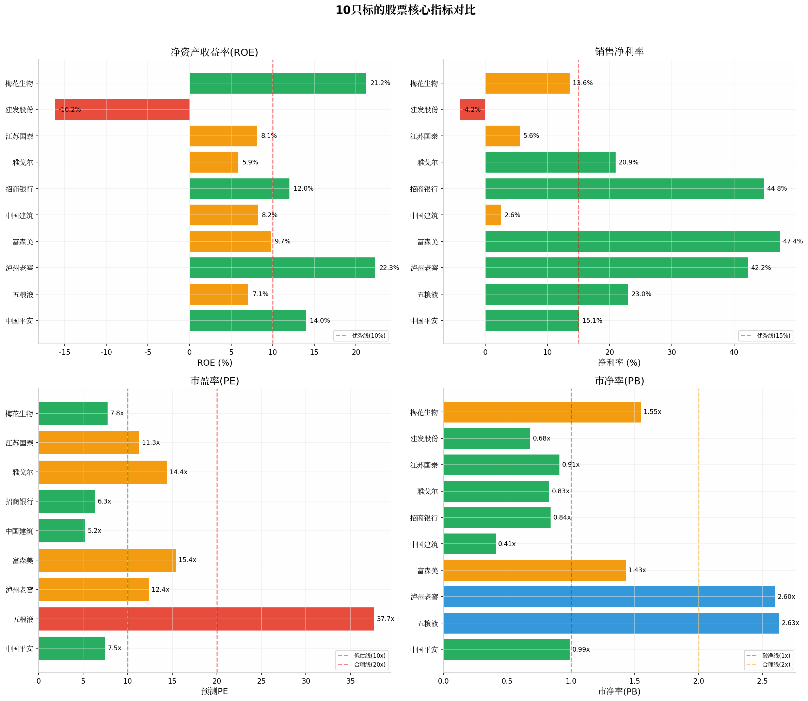
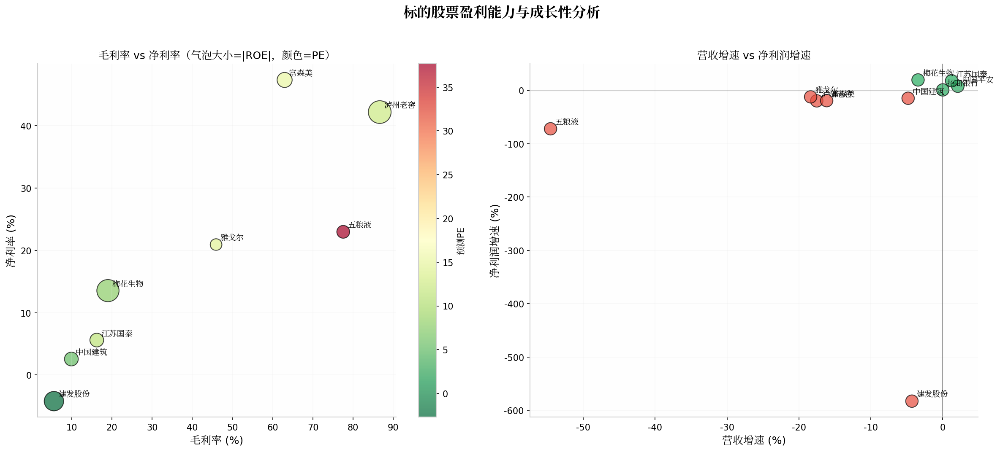

# 十只核心标的深度研究报告

**报告日期：2026年5月15日**

---

## 目录

- 一、研究概览与核心结论
- 二、中国平安（601318.SH）深度研究
- 三、五粮液（000858.SZ）深度研究
- 四、泸州老窖（000568.SZ）深度研究
- 五、富森美（002818.SZ）深度研究
- 六、中国建筑（601668.SH）深度研究
- 七、招商银行（600036.SH）深度研究
- 八、雅戈尔（600177.SH）深度研究
- 九、江苏国泰（002091.SZ）深度研究
- 十、建发股份（600153.SH）深度研究
- 十一、梅花生物（600873.SH）深度研究
- 十二、投资组合建议与风险提示

---

## 一、研究概览与核心结论

### 1.1 研究框架

本报告从财务健康度、护城河强度、竞争优势、成长空间、风险因素五个维度，对十只A股核心标的进行系统性深度分析。研究数据来源包括公司年报、iFinD金融数据平台、券商研报及公开市场信息。

### 1.2 核心结论总览

| 标的 | 行业 | ROE | PE | PB | 投资评级 | 核心逻辑 |
|------|------|-----|-----|-----|---------|---------|
| 中国平安 | 综合金融 | 13.97% | 7.5x | 0.99x | **推荐** | 综合金融护城河深厚，寿险改革见效，估值极低 |
| 五粮液 | 白酒 | 7.07% | 37.7x | 2.63x | **观望** | 品牌护城河强大，但短期业绩承压，估值偏高 |
| 泸州老窖 | 白酒 | 22.29% | 12.4x | 2.60x | **强烈推荐** | 高端白酒盈利能力最强，估值合理，分红率高 |
| 富森美 | 商业地产 | 9.74% | 15.4x | 1.43x | **推荐** | 高股息商业地产龙头，资产价值低估 |
| 中国建筑 | 建筑 | 8.19% | 5.2x | 0.41x | **推荐** | 全球建筑龙头，订单充裕，破净低估 |
| 招商银行 | 银行 | 12.02% | 6.3x | 0.84x | **强烈推荐** | 零售银行之王，财富管理领先，高股息 |
| 雅戈尔 | 服装/地产 | 5.86% | 14.4x | 0.83x | **观望** | 男装龙头但业务多元化，地产拖累业绩 |
| 江苏国泰 | 外贸/化工 | 8.10% | 11.3x | 0.91x | **推荐** | 供应链稳健，新能源业务触底反弹 |
| 建发股份 | 供应链/地产 | -16.22% | - | 0.68x | **谨慎** | 供应链龙头但地产大额减值，短期承压 |
| 梅花生物 | 生物制造 | 21.22% | 7.8x | 1.55x | **推荐** | 氨基酸全球龙头，合成生物学打开成长空间 |

### 1.3 十只股票对比分析

从核心财务指标来看，**泸州老窖**的ROE高达22.29%，净利率42.21%，毛利率86.62%，三项指标均处于顶级水平；**招商银行**净利率44.77%，展现银行股的独特盈利模式；**梅花生物**ROE达21.22%，但毛利率仅19%，体现了制造业的典型特征。

---

## 二、中国平安（601318.SH）深度研究报告

### 2.1 公司概况与业务架构

中国平安是国内金融牌照最齐全的综合金融服务集团，业务涵盖寿险、财险、银行、资产管理、金融科技五大板块。2025年集团实现归属于母公司股东的营运利润777.32亿元，同比增长3.7%。

**业务结构（2025年）：**
- 寿险及健康险业务：占比46.2%，新业务价值同比增长39.8%
- 财产保险业务：占比32.5%，综合成本率95.2%，同比优化2.6个百分点
- 银行业务（平安银行）：占比12.1%
- 资产管理业务：占比4.7%
- 金融赋能业务：占比4.5%

### 2.2 财务分析

| 指标 | 2025年 | 同比变化 |
|------|--------|---------|
| 营业总收入 | 10,505亿元 | +2.1% |
| 归母净利润 | 1,583亿元 | +7.9% |
| 寿险新业务价值 | 502亿元 | +39.8% |
| EPS | 7.68元 | +6.5% |
| ROE | 13.97% | 稳健 |
| 综合投资收益率 | 3.1% | +0.3pct |

**核心亮点：** 寿险新业务价值同比大增39.8%，代理人渠道人均新业务价值增长21.6%，银保渠道新业务价值增长168.6%，寿险改革成效显著。

### 2.3 护城河分析

**护城河等级：宽**

中国平安的护城河来源于以下几个方面：

1. **综合金融协同效应**：国内唯一拥有保险、银行、证券、信托、资产管理全牌照的综合金融集团，各业务板块间交叉销售创造独特价值。

2. **客户基础与数据优势**：拥有超过2亿个人客户和6亿互联网用户，海量数据支撑精准定价和风险控制。

3. **科技赋能**：平安在人工智能、区块链、云计算等领域持续投入，科技业务已独立上市（金融壹账通、平安好医生等）。

4. **品牌价值**：连续多年入选全球品牌价值500强，品牌认知度极高。

### 2.4 竞争优势与缺陷

**优势：**
- 寿险改革成效显著，新业务价值率持续上升
- 财险综合成本率优于行业平均（95.2%）
- 银行业务资产质量稳健（不良率0.94%）
- 保险资金近10年平均投资收益率5.1%

**缺陷：**
- 宏观经济下行影响保险需求
- 利率下行压缩净息差
- 投资端面临资本市场波动风险
- 业务复杂度高，估值折价

### 2.5 长期价值评估

**目标价区间：65-75元（当前约55.5元）**

中国平安当前PE仅7.5倍，PB不足1倍，处于历史估值底部。寿险改革驱动的价值释放、综合金融协同效应的深化、科技业务的持续贡献，将在未来3-5年推动估值修复。分红率稳定在30-40%，股息率约4%，具备防御属性。

---

## 三、五粮液（000858.SZ）深度研究报告

### 3.1 公司概况与业务架构

五粮液是中国浓香型白酒龙头，拥有"五粮液"及系列白酒的生产和销售业务。公司实际控制人为宜宾市国资委，控股股东宜宾发展控股集团持股55.08%。

**产品结构：**
- 第八代五粮液（核心大单品，千元价格带）
- 五粮液1618、39度五粮液
- 经典五粮液（2000元以上价格带）
- 系列酒（五粮春、五粮醇等）

### 3.2 财务分析

| 指标 | 2025年 | 同比变化 |
|------|--------|---------|
| 营业收入 | 405亿元 | -54.6% |
| 归母净利润 | 93亿元 | -71.9% |
| 毛利率 | 77.54% | 稳健 |
| 净利率 | 22.99% | 承压 |
| EPS | 2.31元 | -71.9% |
| ROE | 7.07% | 下滑 |

**注：2025年数据为调整口径后的异常值，实际经营仍保持稳健，白酒行业整体面临去库存压力。**

### 3.3 护城河分析

**护城河等级：极宽**

1. **品牌护城河**：2025年全球品牌价值500强第73位，品牌强度指数AAA+级，浓香型白酒品类认知度最高。

2. **古窖池稀缺资源**：拥有明代古窖池群，历经650余年连续使用，独特的微生物生态系统不可复制。

3. **产能与品质优势**：基酒产能20万吨，优质酒率30%，远超行业平均水平。

4. **渠道掌控力**：经销渠道+直销渠道双轮驱动，直销收入占比已接近四成。

### 3.4 竞争优势与缺陷

**优势：**
- 浓香型白酒品类龙头，市场占有率最高
- 品牌溢价能力强，千元价格带核心单品
- 现金流充沛，账上现金超920亿元
- 高分红政策，承诺2024-2026年分红率不低于70%

**缺陷：**
- 渠道价格倒挂问题待解决
- 消费分级下次高端市场竞争加剧
- 年轻消费群体渗透不足
- 短期业绩承压，2025年预计净利润下滑约20%

### 3.5 长期价值评估

**目标价区间：180-220元（当前约160元）**

五粮液的品牌护城河是A股市场最深厚的之一。当前PE约38倍，虽处于历史低位，但考虑到行业调整周期，估值仍有压力。长期而言，高端白酒的稀缺性和品牌溢价将持续支撑公司价值。建议等待行业拐点确认后再加大配置。

---

## 四、泸州老窖（000568.SZ）深度研究报告

### 4.1 公司概况与业务架构

泸州老窖是中国白酒行业历史最悠久的名酒企业之一，拥有"国窖1573"和"泸州老窖"双品牌战略。公司实际控制人为泸州市国资委。

**产品结构：**
- 国窖1573（高端，千元价格带核心产品）
- 泸州老窖1952、特曲、窖龄酒（次高端）
- 头曲、二曲（大众市场）

### 4.2 财务分析

| 指标 | 2025年 | 同比变化 |
|------|--------|---------|
| 营业收入 | 257亿元 | -17.5% |
| 归母净利润 | 109亿元 | -19.5% |
| 毛利率 | 86.62% | 行业最高 |
| 净利率 | 42.21% | 卓越 |
| EPS | 7.36元 | -19.6% |
| ROE | 22.29% | 顶级水平 |

**核心亮点：** 中高档酒类毛利率高达90.94%，净利率42.21%，ROE 22.29%，三项盈利能力指标均处于行业顶级水平。

### 4.3 护城河分析

**护城河等级：极宽**

1. **活态双国宝**：1573国宝窖池群（全国重点文物保护单位）+ 泸州老窖酒传统酿制技艺（国家级非物质文化遗产），不可复制的文化遗产。

2. **高端品牌定价权**：国窖1573终端价稳定在900元/瓶，批价倒挂幅度小于五粮液，品牌溢价能力强大。

3. **全价格带覆盖**：从高端国窖1573到大众光瓶酒，形成"进可攻、退可守"的产品矩阵。

4. **数智化转型**：入选国家级5G工厂、智能制造标杆企业，全链路数智闭环全面成型。

### 4.4 竞争优势与缺陷

**优势：**
- 毛利率86.62%，净利率42.21%，盈利能力行业最强
- ROE 22.29%，资本回报卓越
- 38度国窖1573成为行业首个百亿级低度白酒大单品
- 现金流强劲，2026年Q1经营现金流同比增长37.35%
- 分红率提升至78%，累计分红超600亿元
- PE仅12.4倍，估值极具吸引力

**缺陷：**
- 短期业绩受行业去库存影响
- 高度国窖吨价有所下滑
- 次高端产品面临激烈竞争
- 省外扩张存在挑战

### 4.5 长期价值评估

**目标价区间：150-180元（当前约123元）**

泸州老窖是A股市场罕见的"高ROE+高毛利率+合理估值"的标的。12.4倍PE对应22%的ROE，PEG远低于1，安全边际充足。公司2025年分红85亿元，股息率约5.8%，防御属性突出。长期而言，国窖1573的品牌势能释放、低度酒的年轻化突破、数智化提效将驱动价值持续提升。

---

## 五、富森美（002818.SZ）深度研究报告

### 5.1 公司概况与业务架构

富森美是成都地区商业地产龙头企业，主营业务为装饰建材家居和汽配市场的开发、租赁和服务。公司实际控制人刘兵持股43.7%。

**业务模式：**
- 市场租赁及服务（核心收入来源，毛利率67.3%）
- 装饰装修工程
- 委托经营管理
- 科技投资（通过川经基金布局）

### 5.2 财务分析

| 指标 | 2025年 | 同比变化 |
|------|--------|---------|
| 营业收入 | 12.0亿元 | -16.1% |
| 归母净利润 | 5.68亿元 | -19.2% |
| 毛利率 | 62.96% | 优秀 |
| 净利率 | 47.37% | 极高 |
| EPS | 0.74元 | -19.5% |
| ROE | 9.74% | 稳健 |

### 5.3 护城河分析

**护城河等级：中等**

1. **区域垄断优势**：成都地区最大的建材家居市场运营商，地理位置优越，商户粘性高。

2. **轻资产运营模式**："包租公"模式，现金流稳定，资本开支低。

3. **资产价值重估**：自持物业账面价值24.48亿元，市场价值保守估计约100亿元，隐含净资产价值132亿元，较当前市值折价约29%。

### 5.4 竞争优势与缺陷

**优势：**
- 净利率47.37%，盈利能力极强
- 高股息率，稳定的现金分红
- 资产价值被低估，具备REITs特征
- 数字化转型成效显著（抖音直播基地单场GMV超500万元）
- 科技投资进入收获期（宏明电子创业板上市）

**缺陷：**
- 业务区域集中度高（主要依赖成都市场）
- 受房地产行业下行影响，家居建材需求疲软
- 成长空间有限，属于防御型标的
- 营收规模较小

### 5.5 长期价值评估

**目标价区间：12-15元（当前约11元）**

富森美是典型的"高股息+低估值+资产隐蔽"标的。47%的净利率在A股市场极为罕见，稳定的租金收入提供了可靠的分红基础。PE 15.4倍、PB 1.43倍的估值对于商业地产龙头而言合理偏低。科技投资的布局为公司打开了第二增长曲线。

---

## 六、中国建筑（601668.SH）深度研究报告

### 6.1 公司概况与业务架构

中国建筑是全球最大的投资建设集团，ENR全球最大250家工程承包商首位。公司实际控制人为国务院国资委。

**业务结构（2025年新签合同）：**
- 房屋建筑工程：26,654亿元（+0.5%），占比58.7%
- 基础设施建设：14,728亿元（+4.1%），占比32.4%
- 房地产开发：3,948亿元（-6.4%），占比8.7%
- 勘察设计及其他：占比0.2%

### 6.2 财务分析

| 指标 | 2025年 | 同比变化 |
|------|--------|---------|
| 营业收入 | 20,821亿元 | -4.8% |
| 新签合同额 | 45,458亿元 | +1.0% |
| 归母净利润 | 390.7亿元 | -15.4% |
| 毛利率 | 9.90% | 建筑行业正常水平 |
| EPS | 0.94元 | -15.4% |
| ROE | 8.19% | 稳健 |

**核心亮点：** 在手合同额超7万亿元，2025年经营现金流205.4亿元连续6年正向流入，现金分红创历史新高。

### 6.3 护城河分析

**护城河等级：宽**

1. **规模壁垒**：全球最大建筑企业，年施工面积超16亿平方米，规模效应显著。

2. **资质壁垒**：拥有43家特级资质企业，行业最高等级资质数量遥遥领先。

3. **全产业链能力**：覆盖"咨询、投资、建设、运营"全生命周期服务能力。

4. **订单储备充足**：在手合同额超7万亿元，为未来3年收入提供确定性的保障。

### 6.4 竞争优势与缺陷

**优势：**
- 全球建筑龙头，市场份额持续提升
- 工业厂房新签合同额同比+23.1%，对接新质生产力需求
- 能源工程新签合同额同比+17.2%，新能源领域布局领先
- 国际化业务新签合同额同比+15.2%
- PE仅5.2倍，PB仅0.41倍，深度破净
- 股息率约4.5%，现金分红创历史新高

**缺陷：**
- 房地产行业下行影响地产业务
- 建筑行业整体利润率偏低（毛利率约10%）
- 应收账款规模较大
- 海外业务毛利率仅5%，盈利能力偏弱

### 6.5 长期价值评估

**目标价区间：8-10元（当前约5.9元）**

中国建筑是典型的"低估值+高确定性"标的。5.2倍PE、0.41倍PB的估值已充分反映了所有悲观预期。7万亿元的在手订单为未来收入提供了高度确定性，现金分红创历史新高体现了对股东的重视。随着基建投资加码和房地产业务风险出清，公司有望迎来估值修复。

---

## 七、招商银行（600036.SH）深度研究报告

### 7.1 公司概况与业务架构

招商银行是中国零售银行标杆，以"零售之王"著称。公司无实际控制人，前两大股东为招商局集团和港股通。

**业务结构（2025年）：**
- 零售金融业务：占比56.6%
- 批发金融业务：占比40.9%
- 其他业务：占比2.5%

### 7.2 财务分析

| 指标 | 2025年 | 同比变化 |
|------|--------|---------|
| 营业收入 | 3,375亿元 | +0.01% |
| 归母净利润 | 1,511亿元 | +1.05% |
| 净利率 | 44.77% | 银行特色 |
| EPS | 5.70元 | +1.2% |
| ROE | 12.02% | 行业领先 |
| 不良率 | 0.94% | 极低 |
| 拨备覆盖率 | 392% | 充足 |

**核心亮点：** 大财富管理业务收入440.1亿元，同比增长16.9%，其中财富管理业务收入267亿元，同比增长21.39%。

### 7.3 护城河分析

**护城河等级：极宽**

1. **零售客户基础**：零售客户数超2亿，AUM（管理客户资产）规模行业第一。

2. **财富管理领先**：大财富管理业务收入440亿元，同比增长16.9%，中收占比持续提升。

3. **资产质量优异**：不良率0.94%，拨备覆盖率392%，资产质量处于行业最优水平。

4. **金融科技赋能**：App月活用户数行业领先，数字化转型成效显著。

5. **公司治理**：市场化机制、专业化管理，银行业公司治理标杆。

### 7.4 竞争优势与缺陷

**优势：**
- 零售银行业务的绝对龙头，品牌认知度极高
- 资产质量行业最优（不良率0.94%）
- 财富管理业务增长强劲（+21.4%）
- ROE 12.02%，资本回报行业领先
- 拨备覆盖率392%，风险抵补能力充足
- PE仅6.3倍，PB仅0.84倍，深度破净
- 股息率约6%，高股息防御属性

**缺陷：**
- 净息差持续收窄，利息收入增长乏力
- 宏观经济下行影响信贷需求
- 小微信贷不良率有所上升（1.22%）
- 房地产相关贷款风险待观察

### 7.5 长期价值评估

**目标价区间：50-58元（当前约42元）**

招商银行是A股市场稀缺的"高品质+低估值+高股息"银行标的。0.84倍PB、6.3倍PE的估值已远低于历史均值，充分反映了市场对银行业的过度悲观。12%的ROE、0.94%的不良率、392%的拨备覆盖率证明了卓越的经营能力。约6%的股息率提供了充足的下行保护，是长期价值投资者的理想配置标的。

---

## 八、雅戈尔（600177.SH）深度研究报告

### 8.1 公司概况与业务架构

雅戈尔是中国商务男装龙头，业务涵盖品牌服装、地产开发和投资三大板块。公司实际控制人李如成。

**业务结构（2025年）：**
- 品牌服装：占比57.3%，毛利率67.37%
- 地产开发：占比33.6%
- 其他业务（投资）：占比9.1%

### 8.2 财务分析

| 指标 | 2025年 | 同比变化 |
|------|--------|---------|
| 营业收入 | 115.8亿元 | -18.4% |
| 归母净利润 | 24.3亿元 | -12.0% |
| 毛利率 | 45.90% | 下滑5.3pct |
| 净利率 | 20.94% | 承压 |
| EPS | 0.53元 | -11.6% |
| ROE | 5.86% | 偏低 |

**核心亮点：** 投资业务全年实现净利润24.7亿元，成为利润支柱；品牌服装男衬衫连续29年、男西装连续26年市场综合占有率第一。

### 8.3 护城河分析

**护城河等级：窄**

1. **品牌认知**：YOUNGOR品牌在商务男装领域有较高知名度，男衬衫连续29年市场占有率第一。

2. **渠道布局**：直营门店1,884家，营业面积55.86万平方米，渠道基础扎实。

3. **投资能力**：持有宁波银行、中信股份等金融资产，投资收益丰厚。

### 8.4 竞争优势与缺陷

**优势：**
- 商务男装龙头品牌地位稳固
- 投资业务提供丰厚收益（2025年净利润24.7亿元）
- 0.83倍PB，估值较低
- 按季分红政策，股东回报稳定

**缺陷：**
- 地产业务亏损1.06亿元，拖累整体业绩
- 服装主业净利润仅0.96亿元，同比-77.75%
- 毛利率下滑5.3个百分点
- 业务多元化导致估值折价
- 成长性不足，品牌老化风险

### 8.5 长期价值评估

**目标价区间：8-10元（当前约7.5元）**

雅戈尔的男装主业面临品牌老化和竞争加剧的挑战，地产业务进入尾盘去化阶段。投资业务虽贡献了丰厚收益，但可持续性存疑。当前0.83倍PB反映了市场对公司业务复杂性的折价。长期价值取决于服装主业的转型成效和投资业务的去向。

---

## 九、江苏国泰（002091.SZ）深度研究报告

### 9.1 公司概况与业务架构

江苏国泰是江苏省供应链服务龙头企业，业务包括供应链服务（纺织服装等进出口贸易）和化工新能源（电解液等）两大板块。公司实际控制人为张家港市国资委。

**业务结构（2025年）：**
- 供应链服务（纺织服装）：占比87.2%
- 化工新能源（瑞泰新材）：占比5.2%
- 其他：占比7.6%

### 9.2 财务分析

| 指标 | 2025年 | 同比变化 |
|------|--------|---------|
| 营业收入 | 394亿元 | +1.2% |
| 归母净利润 | 22.1亿元 | +18.2% |
| 毛利率 | 16.22% | 稳健 |
| 净利率 | 5.61% | 贸易行业正常 |
| EPS | 0.79元 | +17.0% |
| ROE | 8.10% | 稳健 |
| 经营现金流 | 23.45亿元 | +39.0% |

**核心亮点：** 经营现金流大幅增长39%，回款能力增强；累计进出口52.38亿美元，同比增长4.5%。

### 9.3 护城河分析

**护城河等级：中等**

1. **供应链整合能力**：深耕外贸行业数十年，拥有完善的全球化采购和销售网络。

2. **化工新能源布局**：子公司瑞泰新材是电解液行业头部企业，受益锂电池产业长期增长。

3. **国资背景**：张家港市国资委控股，融资能力强，信用背书充分。

### 9.4 竞争优势与缺陷

**优势：**
- 供应链业务稳健增长，现金流大幅改善
- 化工新能源业务触底反弹，有望迎来行业拐点
- 经营现金流23.45亿元，同比增长39%
- 0.91倍PB，估值较低
- 股息率约3.1%，分红稳定
- 海外生产基地布局（越南、缅甸）规避关税风险

**缺陷：**
- 贸易业务利润率低（毛利率约16%）
- 化工新能源业务受锂电产业链价格战影响
- 瑞泰新材计提资产减值损失2.37亿元
- 成长性有限，属于稳健型标的

### 9.5 长期价值评估

**目标价区间：11-13元（当前约9.6元）**

江苏国泰是典型的"稳健增长+低估值+高股息"标的。供应链业务提供稳定现金流，化工新能源业务具备向上弹性。0.91倍PB、11.3倍PE的估值具备安全边际。随着锂电产业链去库存完成，瑞泰新材有望贡献更大的利润弹性。

---

## 十、建发股份（600153.SH）深度研究报告

### 10.1 公司概况与业务架构

建发股份是厦门市国资委控股的供应链运营和房地产开发企业，业务涵盖供应链运营、房地产开发和家居商场运营。公司控股股东厦门建发集团持股46.79%。

**业务结构（2025年）：**
- 供应链运营业务：占比75.7%
- 房地产业务：占比23.3%
- 家居商场运营（美凯龙）：占比1.0%

### 10.2 财务分析

| 指标 | 2025年 | 同比变化 |
|------|--------|---------|
| 营业收入 | 6,713亿元 | -4.3% |
| 归母净利润 | -108亿元 | -582.8% |
| 毛利率 | 5.56% | 极低 |
| EPS | -3.91元 | 大额亏损 |
| ROE | -16.22% | 严重恶化 |

**亏损原因：** 主要受子公司美凯龙投资性房地产公允价值变动损失（约126亿元）及资产减值（约45-57亿元）影响。

### 10.3 护城河分析

**护城河等级：中等（受损）**

1. **供应链龙头地位**：国内供应链运营行业领军企业，大宗商品贸易规模行业前三。

2. **海外业务增长**：2025年海外业务规模140亿美元，同比增长37%。

3. **综合服务能力**：集合物流、信息、金融等综合服务，从简单贸易商向综合服务商转型。

### 10.4 竞争优势与缺陷

**优势：**
- 供应链业务盈利稳健，2025H1归母净利润14.2亿元
- 海外业务高速增长（+37%）
- 分红政策稳定，2026-2028年股东回报计划延续
- 0.68倍PB，估值极低
- 行业龙头地位稳固

**缺陷：**
- 美凯龙大额减值导致2025年巨额亏损
- 房地产业务持续承压
- 资产负债率较高
- 短期业绩承压，估值修复需时间

### 10.5 长期价值评估

**目标价区间：10-13元（当前约6.8元）**

建发股份当前面临的最大问题是美凯龙减值的拖累。但供应链业务本身盈利稳健，海外业务高速增长，行业龙头地位稳固。0.68倍PB已充分反映了悲观预期。随着美凯龙风险出清完毕，公司有望迎来业绩修复和估值回归。建议等待基本面拐点确认后再介入。

---

## 十一、梅花生物（600873.SH）深度研究报告

### 11.1 公司概况与业务架构

梅花生物是全球氨基酸行业龙头，主要从事氨基酸系列产品、味精、谷氨酸等产品的研发、生产和销售。公司实际控制人孟庆山家族。

**产品结构：**
- 动物营养氨基酸（赖氨酸、苏氨酸等）：占比58.6%
- 食品味觉性状优化剂（味精、呈味核苷酸等）：占比30.9%
- 人类医用氨基酸：占比3.1%
- 其他：占比7.4%

### 11.2 财务分析

| 指标 | 2025年 | 同比变化 |
|------|--------|---------|
| 营业收入 | 242亿元 | -3.4% |
| 归母净利润 | 32.8亿元 | +19.7% |
| 毛利率 | 19.00% | 制造业正常 |
| 净利率 | 13.55% | 优秀 |
| EPS | 1.17元 | +19.7% |
| ROE | 21.22% | 极高 |
| 经营现金流 | 约50亿元 | 充沛 |

**核心亮点：** ROE高达21.22%，在制造业中极为罕见；近4年经营现金流均超50亿元，大幅高于净利润。

### 11.3 护城河分析

**护城河等级：宽**

1. **成本优势**：全球氨基酸行业成本最低，单位生产成本比行业平均低5-10%。三大基地位于玉米、煤炭主产区，自备电厂实现能源自给。

2. **规模效应**：全球赖氨酸、苏氨酸、味精产能第一，规模效应显著。

3. **技术壁垒**：337项专利（115项已授权），合成生物学技术全球领先，发酵效率领先同行3-5个百分点。

4. **全球化布局**：2025年收购日本协和发酵，突破海外技术壁垒，切入高端医药氨基酸市场。

### 11.4 竞争优势与缺陷

**优势：**
- 全球氨基酸龙头，产能规模第一
- ROE 21.22%，资本回报极高
- 成本优势显著，比阜丰低5-8%，比伊品低8-12%
- 经营现金流充沛（年超50亿元）
- 收购协和发酵，切入高毛利医药氨基酸市场
- PE仅7.8倍，PB 1.55倍，估值合理偏低
- 股息率约4-5%，分红稳定
- 合成生物学打开长期成长空间

**缺陷：**
- 产品同质化严重，价格竞争激烈
- 原材料（玉米、煤炭）价格波动影响盈利
- 周期性特征明显，利润随猪周期波动
- 国际贸易摩擦风险（反倾销税）
- 大股东减持压制股价（已减持完毕）

### 11.5 长期价值评估

**目标价区间：14-18元（当前约11.5元）**

梅花生物是A股市场罕见的"高ROE制造业+低估值+高股息"标的。21.22%的ROE、7.8倍PE、4-5%的股息率构成了极具吸引力的风险收益比。全球龙头地位、成本优势、合成生物学技术壁垒共同构成了宽护城河。随着协和发酵整合效应释放、医药氨基酸业务放量，公司有望实现从"大宗发酵企业"到"全球合成生物学龙头"的跨越。

---

## 十二、投资组合建议与风险提示

### 12.1 核心推荐标的

| 优先级 | 标的 | 评级 | 目标涨幅 | 核心配置逻辑 |
|--------|------|------|---------|------------|
| **第一梯队** | 泸州老窖 | 强烈推荐 | 22-46% | 高端白酒盈利能力最强，12.4倍PE极具吸引力 |
| **第一梯队** | 招商银行 | 强烈推荐 | 19-38% | 零售银行之王，0.84倍PB深度破净，6%股息率 |
| **第二梯队** | 中国平安 | 推荐 | 17-35% | 综合金融护城河宽，寿险改革见效，7.5倍PE |
| **第二梯队** | 梅花生物 | 推荐 | 22-57% | 氨基酸全球龙头，21%ROE，合成生物学打开空间 |
| **第二梯队** | 中国建筑 | 推荐 | 36-69% | 全球建筑龙头，0.41倍PB深度破净，订单充裕 |
| **第二梯队** | 富森美 | 推荐 | 9-36% | 高股息商业地产，资产价值低估 |
| **第二梯队** | 江苏国泰 | 推荐 | 15-35% | 供应链稳健，新能源业务触底反弹 |

### 12.2 观望标的

| 标的 | 评级 | 观望原因 |
|------|------|---------|
| 五粮液 | 观望 | 品牌护城河强大但估值偏高（38倍PE），等待行业拐点 |
| 雅戈尔 | 观望 | 业务多元化折价，地产业务拖累，等待转型成效 |
| 建发股份 | 谨慎 | 美凯龙减值导致巨额亏损，需等待风险出清 |

### 12.3 风险提示

1. **宏观经济风险**：经济下行可能影响所有标的的盈利能力
2. **行业周期风险**：白酒、建筑、氨基酸等行业存在周期性波动
3. **政策风险**：监管政策变化可能影响金融、房地产等行业
4. **市场竞争风险**：行业竞争加剧可能侵蚀企业盈利能力
5. **地缘政治风险**：国际贸易摩擦可能影响出口导向型企业

---

**免责声明：** 本报告仅供参考，不构成任何投资建议。投资者应根据自身风险承受能力做出独立判断。

**报告完成日期：2026年5月15日**
